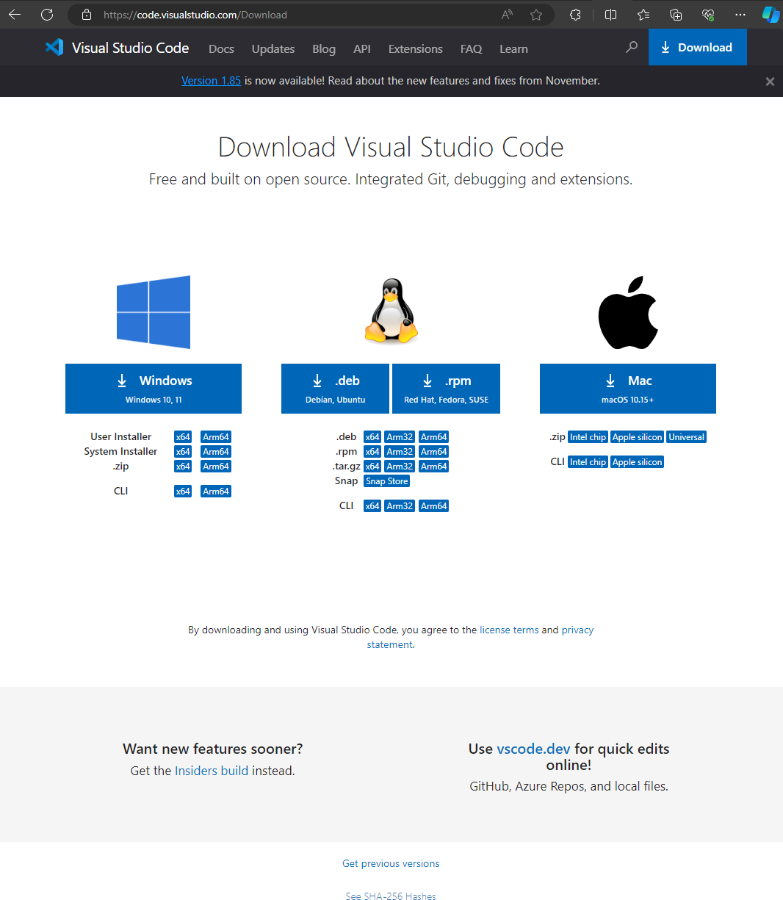
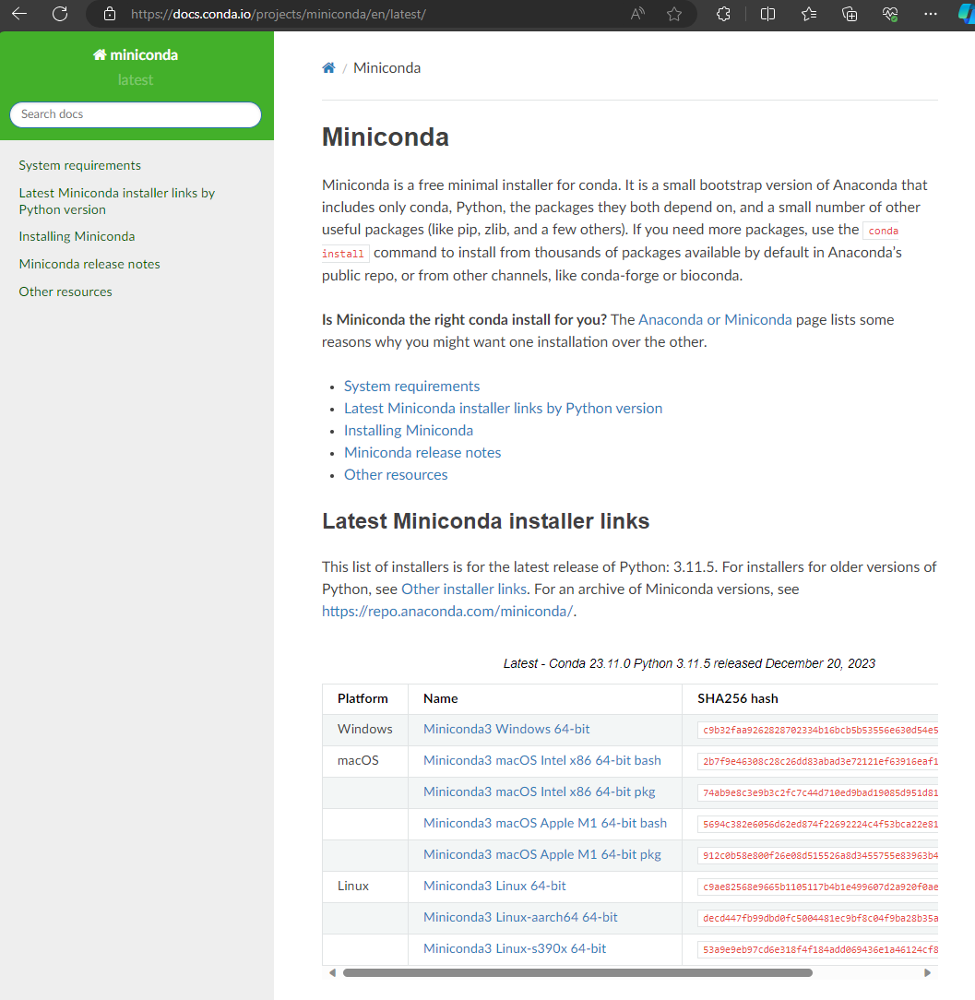
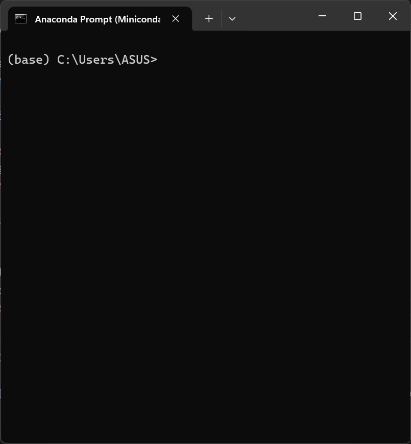
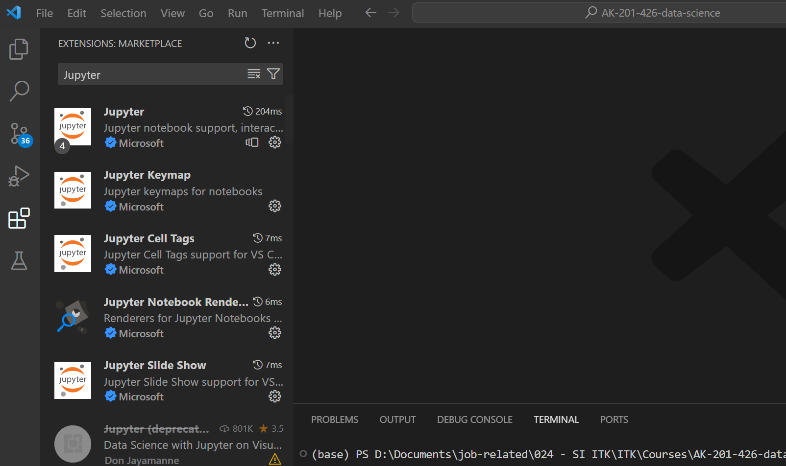
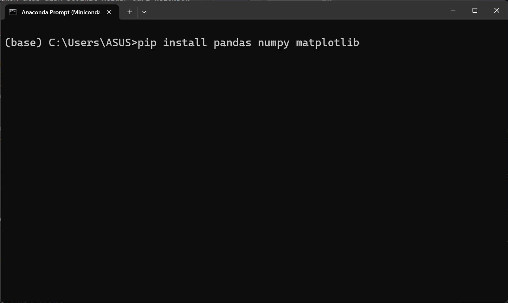
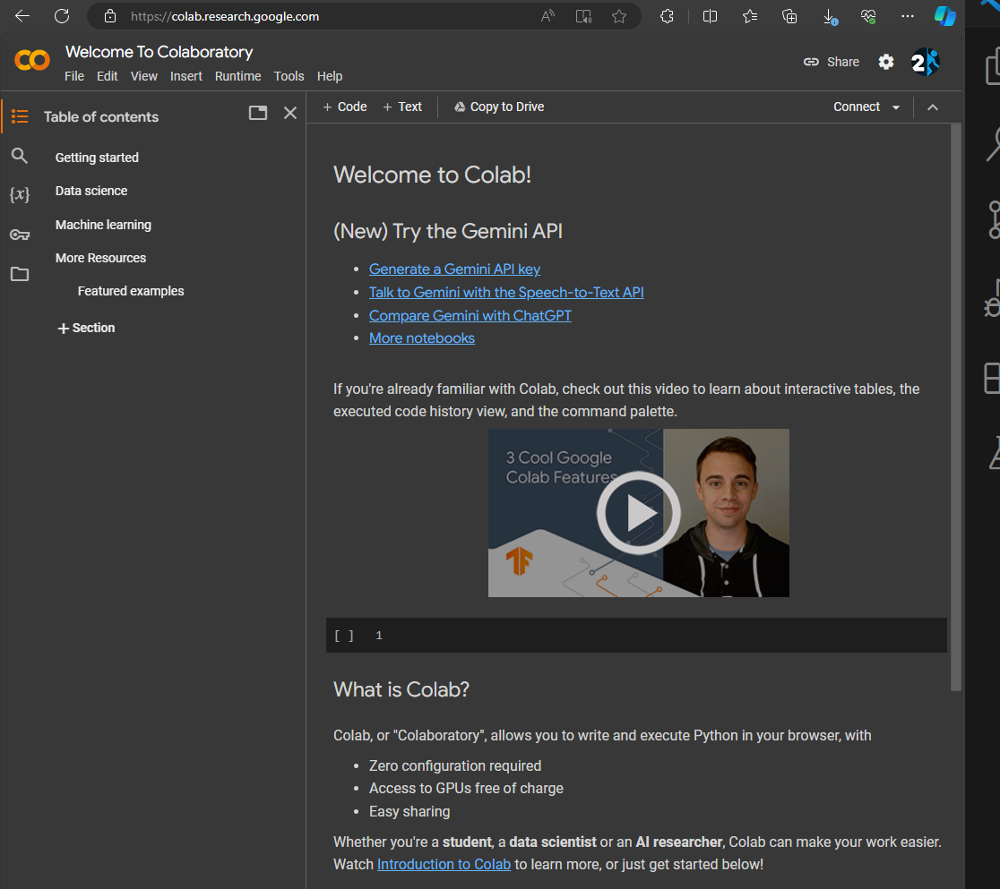
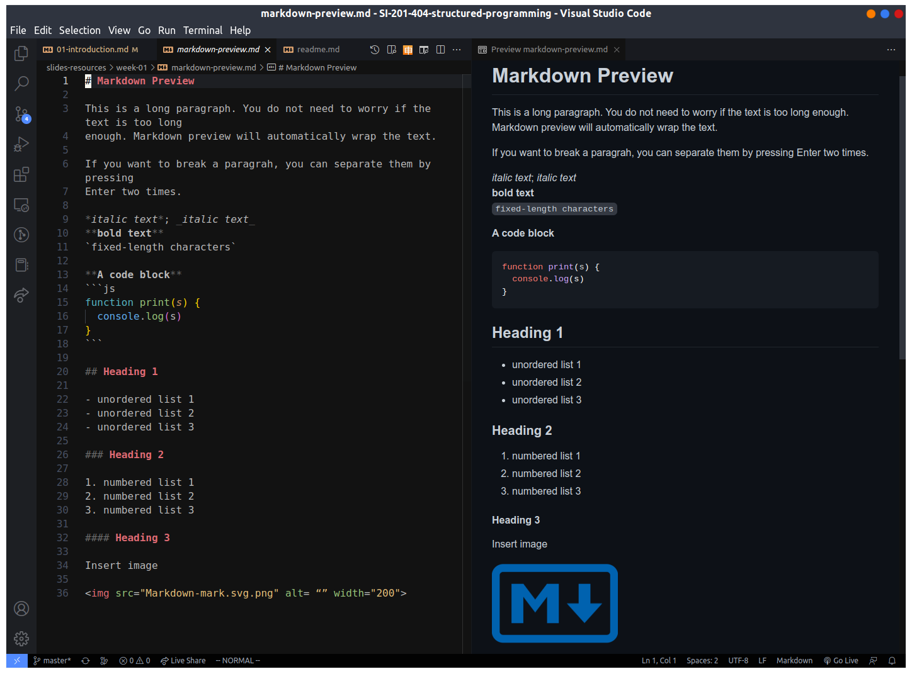

# Modul praktikum - Minggu 02 - Instalasi VSCode dan Python for Data Science

Dosen pengampu: **Henokh Lugo Hariyanto**; **Diana Nurlaily**   
Asisten mata kuliah: **Ukthi Nurul Isnaniah (16211028)**

**Tujuan**:
- Mampu menjalankan program Python sederhana menggunakan Jupyter Notebook 
  dalam VSCode
- Mampu menggunakan _libraries_ Python: `pandas`, `numpy`, dan `matplotlib`
  untuk melakukan _plotting_ sederhana dari data `.csv`

> Tips belajar bahasa pemrograman adalah mengetik ulang perintah yang kita
> temukan di buku ataupun di internet, lalu kita ubah-ubah untuk menguji 
> pemahaman kita sudah tepat atau belum. Faktor bermain-main dan eskplorasi
> sangat diperlukan untuk memahami setiap perintah bahasa pemrograman yang
> kita pelajari. Setiap potongan kode di bawah dapat dijalankan secara lokal
> menggunakan VSCode dan Jupyter Notebook, atau menggunakan Google Collabs.

## Instalasi beberapa program dan _libraries_

Untuk memahami seluruh materi dalam perkuliahan ini diperlukan juga _software_
penunjang yaitu VSCode. Alasan dipilih VSCode adalah cukup ringan dibanding
PyCharm atau Spyder dan memiliki kemampuan _editing_ dan _running_ berkas
Jupyter Notebook.

### VSCode

VSCode diperlukan untuk menjalankan _interface_ Jupyter Notebook dan 
untuk melakukan _editing_. Instalasi dapat mengikut petunjuk berikut 
(petunjuk berikut hanya diperuntukkan untuk pengguna Windows):

1. Pertama-tama download berkas instalasi VSCode dari link berikut:
   [https://code.visualstudio.com/Download](https://code.visualstudio.com/Download).
   Pilih installer untuk Windows 10 atau 11

   

2. Ikuti instruksi standard yang diberikan saat proses instalasi 
   (tekan Next atau Yes). Setelah instalasi dilakukan maka akan muncul
   tampilan Welcome Page sebagai berikut (bukan program VSCode
   bila tidak muncul setelah proses instalasi)

   

Di titik ini, VSCode sudah terinstall di komputer kalian dan siap untuk
melanjutkan proses instalasi berikutnya yaitu Miniconda.

### Miniconda

Program Mniconda merupakan versi program dengan ukuran lebih kecil
dari program induknya yang disebut Anaconda. Program Miniconda atau Anaconda
ini merupakan program untuk mengatur manajemen versi Python dan module
pendukung untuk setiap proyek-proyek yang memiliki versi Python dan 
module yang saling berbeda.

Dengan adanya environment yang terpisah untuk setiap proyek, maka kita
tidak perlu khawati apabila terjadi perbedaan versi Python dan module-nya
antar satu proyek dengan proyek yang lain. Pada perkuliahan ini, kalian
cukup menggunakan satu environment yang secara _default_ disediakan oleh
Miniconda yaitu environment _base_. Apabila kalian ingin membuat environment
baru untuk proyek yang lain dipersilahkan untuk menelusuri bagaimana 
pembuatan dan penyusunan environment baru di halaman 
[dokumentasi Miniconda/Anaconda](https://docs.conda.io/projects/conda/en/stable/user-guide/getting-started.html)


Disini hanya diberikan panduan instalasi untuk pengguna Windows. Silahkan
ikuti petunjuk berikut untuk melakukan proses instalasi:
1. Kunjungi halaman unduhan untuk program Miniconda di link berikut:
   [https://docs.conda.io/projects/miniconda/en/latest/](https://docs.conda.io/projects/miniconda/en/latest/). Lalu pilih `Miniconda3 Windows 64-bit`

   

2. [opsional] Jika kalian ingin memastikan bahwa berkas yang kalian
   unduh benar-benar berkas Miniconda installer, kalian dapat melakukan
   pemeriksaan integritas SHA256 dengan cara mengetikkan baris berikut
   di Terminal atau PowerShell, namun sebelumnya Termninal atau PowerShell
   harus diarahkan ke dalam folder tempat berkas unduhan Miniconda 
   installer berada (bisa menggunakan perintah `cd` (change directory))

   ```
   Get-FileHash .\Miniconda3-latest-Windows-x86_64.exe -Algorithm SHA256
   ```

   Lalu periksa apakah kode SHA256 yang dihasilkan dari pengetikan perintah
   di atas sama dengan kode SHA256 pada kolom SHA256 hash di halaman
   unduhan Miniconda. Jika tidak sama, berarti berkas yang kalian
   download bukan lagi berkas Miniconda, melainkan berkas lain yang
   mungkin saja sudah disisipi program tambahan yang dapat 
   mengakibatkan kerusakan sistem. Dan kalian harus tidak menginstal
   program tersebut apabila SHA256 berbeda dengan SHA265 pada laman
   unduhan Miniconda.

3. Double click pada berkas Miniconda installer `.exe`, dan ikuti
   panduan standard sesuai yang diberikan. Kalian diperbolehkan
   untuk melakukan setting yang berbeda jika mengerti maksud 
   petunjuk yang diberikan selama proses instalasi.

4. Setelah instalasi berhasil, kalian dapat menemukan program 
   dengan nama "Anaconda Prompt (Miniconda 3)". Buka program tersebut
   untuk memulai menginisiasi environment `base`.

   


Di titik ini, kalian sudah melakukan instalasi VSCode dan Python (melalui
miniconda). Langkah selanjutnya adalah melakukan instalasi _extension_
di VSCode (termasuk Jupyter Notebook) dan module Python yang lainnya.

### Jupter Notebook + other extensions and Python modules

Langkah berikut diperlukan supaya VSCode dapat melakukan _opening_,
_editing_, dan _running_ berkas Jupyter Notebook. Untuk itu diperlukan
instalasi tiga ekstensi berikut:

1. Jupyter (by Microsoft)
2. Python (by Microsoft)
3. Markdown Preview Github Styling (by Matt Bierner)

Pastikan bahwa ekstensi yang kalian instal memiliki nama pembuat (developer)
yang sesuai dengan nama developer yang ada di dalam kurung di list di atas.
Ada sejumlah ekstensi yang memiliki nama kembar namun berbeda _author_.

Langkah berikut hanya ditunjukkan untuk instalasi ekstensi Jupyter, untuk
ekstensi lain memiliki cara yang sama

1. Buka program VSCode, selanjutnya pada panel sebelah kiri, klik 
   ikon ekstensi (ikon yang tersusub dari 4 buah kotak kecil, dengan
   kotak kecil di bagian pojok kanan atas agak sedikit keluar dari kelompok
   3 kotak kecil lainnya)

   

2. Kemudian di kotak pencarian "Search box", ketik "Jupyter".
   Lakukan instalasi ekstensi Jupyter dengan melakukan klik pada
   tombol biru bertuliskan "Install". Jika sebelumnya sudah pernah 
   dilakukan instalasi maka tombol biru bertuliskan "Install" ini tidak
   akan muncul dan kalian bisa melanjutkan untuk proses instalasi 
   dua ekstensi yang lain.

3. Kemudian buka kembali program "Anaconda Prompt (Minconda3)
   lalu jalankan tiga perintah berikut untuk melakukan instalasi modul
   `pandas`, `numpy`, dan `matplotlib`

   


Jika sudah selesai dilakukan, maka di titik ini kalian sudah siap
untuk melakukan pembelajaran sains data menggunakan Python.
Silahkan lanjutkan pada tahap berikutnya untuk melakukan
pembacaan data, analisis data, dan penggambaran grafik.

## (opsi 2) Google Colab

Apabila kalian ingin tidak terlalu pusing dengan proses intalasi di atas.
Kalian dapat menggunakan Google Colab dengan cara login dengan akun
ITK (atau akun Gmail), kemudian masuk ke halaman 
[https://colab.research.google.com/](https://colab.research.google.com/)
dan silahkan untuk memulai pengetikan kode Python.



## Membaca data, mengolah data, dan melakukan _plotting_ sederhana

Pada tutorial berikut, kita akan melakukan pembacaan data Gini rasio,
lalu melakukan plotting sederhana

Ikut langkah-langkah berikut dari awal sampai akhir. Kita juga dapat
menggunakan Jupyter Notebook yang sudah disediakan disini [week-02.ipynb](../jupyter-notebooks/week-02.ipynb)

1. Buka program VSCode dan buat folder baru `hands-on-tutorial`,
   dan sub-folder `week-02`

2. Buat file Jupyter Notebook di dalam subfolder `week-02` dan beri nama
   `week-02.ipynb`

3. Pilih kernel (environment `base`) di pojok kanan atas VSCode.

4. Ketik perintah berikut untuk memuat module: `numpy`, `pandas`, dan
   `matplotlib` ke dalam berkas Jupyter notebook `week-02.ipynb`
   ```py
   import numpy as np 
   import pandas as pd
   import matplotlib.pyplot as plt
   ```

### Pembacaan data `.csv`

5. Pertama kita _load_ data `.csv` menggunakan module `pandas` dengan perintah 
   berikut:
   ```py
   df = pd.read_csv("../datasets/gini_rasio_kaltim.csv")      
   ```

   Data yang kita _load_ di atas adalah data Gini rasio untuk provinsi Kalimantan
   Timur yang didapatkan dari [Badan Pusat Statistik](https://www.bps.go.id/id/statistics-table/2/OTgjMg==/gini-rasio--maret-2023.html)


### Menghitung nilai rata-rata

6. Berikutnya kita hitung nilai rata-rata Gini rasio dari tahun 2009 hingga 
   2023 untuk provinsi Kalimantan Timur. Perhitungan rata-rata dapat
   dilakukan dengan bantuan fungsi `np.mean()`. Bagian kolom `gini_ratio`
   dapat kita akses dengan perintah `df["gini_ratio"]`

   ```py
   gini_ratio_avg = np.mean(df["gini_ratio"])
   ```

### Membuat plot _time series_ 

7. Kode program untuk membuat plot cukup panjang karena banyak 
   _styling_ yang harus kita terapkan. Namun sebelumnya kita ketik 
   terlebih dahulu perintah berikut, dan kemudian akan dijelaskan 
   tiap baris dari setiap perintah yang telah dituliskan 

   ```py
   fig, ax = plt.subplots(figsize=(8, 4))

   ax.plot(df["year"], df["gini_ratio"], marker="o", markersize=8, 
         markerfacecolor="w", markeredgewidth=2, linewidth=2)
   ax.axhline(y=gini_ratio_avg, color="r", alpha=0.4)

   ax.set_title("Gini ratio of Balikpapan")
   ax.grid("on")
   ax.set_xlabel("Year")
   ax.set_ylabel("Gini ratio")
   plt.show(fig)
   ```

   Berikut penjelasan kode program di atas:  
   1. ```fig, ax = plt.subplots(figsize=(8, 4)) ```  
      Perintah ini digunakan untuk meng-inisiasi/membuat object figure
      dan axis kosong yang memiliki ukuran `figsize=(width, height)`
   
   2. `ax.plot()`   
      Merupakan perintah untuk membuat plot berbentuk garis.
      Dua argument pertama merupakan data untuk koordinat-x dan kordinat-y.
      Pada fungsi ini terlihat terdapat setting untuk jenis marker 
      (`marker='o` dipilih marker berbentuk circle); ukuran marker
      (`markersize=8`); warna isian marker (`markerfacecolor="w"` dipilih 
      warna putih/"white"/"w"); tebal garis tepi di marker 
      (`markeredgewidth=2`); tebal garis penghubung antar koordinat
      (`linewidth=2`)

   3. `ax.axhline()`   
      Merupakan perintah untuk membuat garis horizontal disepanjang 
      bentangan axis. Argument pertama merupakan posisi vertikal
      dari garis horizontal tersebut. Disini kita atur supaya memiliki
      nilai rata-rata Gini rasio. Beberapa pengaturan seperti `color="r"`
      dan `alpha=0.4` digunakan untuk mengatur warna dari garis tersebut
      dan tingkat transparansi.

   4. `ax.set_title()`: untuk mengatur judul dari plot

   5. `ax.grid("on")`: untuk memunculkan garis _grid_ atau tidak.
      Disini kita atur agar muncul dengan nilai `on` .

   6. `ax.set_xlabel()` dan `ax.set_ylabel()`: digunakan untuk
      memberikan penamaan label di sumbu-x dan sumbu-y.

   7. `plt.show(fig)`: untuk menampilkan pada _cell output_ di Jupyter Notebook.
      
   Jika kita lihat dengan seksama, untuk menggambar plot dengan matplotlib
   memiliki struktur sebagai berikut:
   - Inisiasi objek `fig` dan `ax`
   - Lalu isi berbagai macam plot pada objek `ax` menggunakan berbagai
     macam methods/functions yang bisa diakses dengan `.` seperti `.plot()`
     `.axhline()`. Jika kita lihat pada dokumentasi ada banyak 
     jenis plot yang disediakan oleh matplotlib
   - Setelah memasukan data ke dalam axis langka berikutnya adalah
     melakukan pengaturan label, gridlines, judul plot, dsb.
   - Terakhir objek `fig` kita tamplikan dengan perintah `plt.show(fig)`


## Tutorial singkat Markdown

Pembaca dapat mengikuti panduan berikut: [Markdown Guide](https://www.markdownguide.org/basic-syntax/).
DI dalam panduan tersebut, kita bisa mencoba satu persatu sintaks yang 
disediakan oleh Markdown. Namun kita bisa mencoba kode Markdown yang diberikan
pada gambar di bawah ini



Untuk bisa menampilkan kode Markdown dalam bentuk seperti yang disebelah
kanan, perlu di-_install_ VSCode _extension_: [Markdown Preview Github Styling](https://marketplace.visualstudio.com/items?itemName=bierner.markdown-preview-github-styles)

Lihat `markdown_template.md` di [link berikut](../markdown-template.md).


## Tugas (Exercise 01)
> Laporan harus ditulis dan dikumpulkan dalam bentuk berkas _markdown_ 
> (berekstensi `.md`). Apabila laporan memuat lebih dari satu beras, misal
> memuat gambar `.png` atau `.jpg`, maka berkas disatukan menjadi berkas 
> `.zip`. **PASTIKAN** berkas `.md` sudah dilakukan _preview_, sehingga kod
> `markdown` bisa di-_preview_ dengan benar di VSCode. Format penamaan file: 
> `NIM_NAMA.md` atau `NIM_NAMA.zip`  (boleh nama lengkap atau nama panggilan).
>
> **Contoh format jawaban (`NIM_NAMA.md`)**   
> Nama: [NAMA LENGKAP]
> NIM: [NIM]
> 1. (Jawaban nomor 1)
> 2. (Jawaban nomor 2)

1. [30 poin] Tuliskan dengan bahasa sendiri, apa yang kalian pelajari 
   dari praktikum ini.

2. [70 poin] Silahkan pelajari mengenai Gini rasio dan bagaimana 
   cara mendapatkan nilai Gini rasio. Cukup dituliskan garis besar
   cara mendapatkan nilai Gini rasio. Sumber berikut mungkin 
   bisa digunakan [https://ourworldindata.org/what-is-the-gini-coefficient](https://ourworldindata.org/what-is-the-gini-coefficient)


