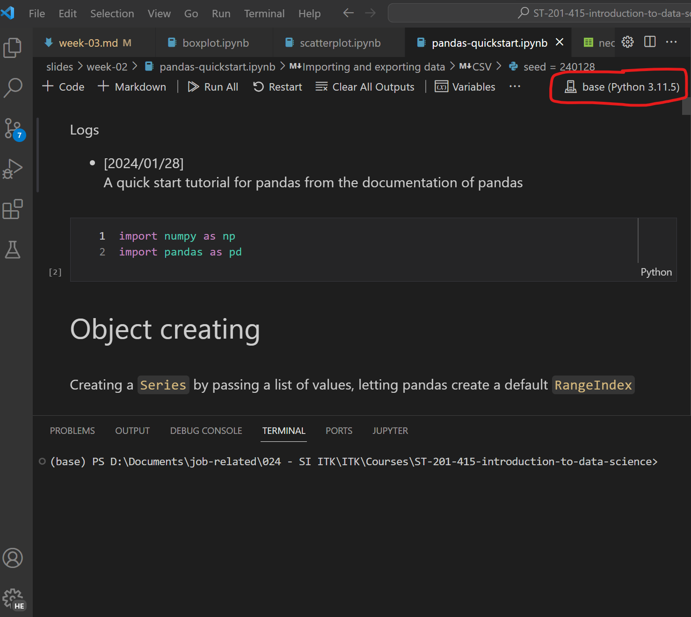

# Modul praktikum - Minggu 03 - Visualization with Python

Dosen pengampu: **Henokh Lugo Hariyanto**; **Diana Nurlaily**   
Asisten mata kuliah: **Ukthi Nurul Isnaniah (16211028)**

**Tujuan**:
- Mampu melakukan pembacaan data menggunakan Python
- Mampu melakukan visualisasi _boxplot_, _histogram_, dan _scatterplot_ dengan _matplotlib_

> Tips belajar bahasa pemrograman adalah mengetik ulang perintah yang kita
> temukan di buku ataupun di internet, lalu kita ubah-ubah untuk menguji 
> pemahaman kita sudah tepat atau belum. Faktor bermain-main dan eskplorasi
> sangat diperlukan untuk memahami setiap perintah bahasa pemrograman yang
> kita pelajari. Setiap potongan kode di bawah dapat dijalankan secara lokal
> menggunakan VSCode dan Jupyter Notebook, atau menggunakan Google Collabs.

## Pembacaan data dengan `pandas`

Selama perkuliahan nanti, kita akan melakukan pembacaan data menggunakan 
_module_ `pandas`. Berikut adalah istilah yang harus dipahami saat menggunakan


Untuk setiap objek/istilah di atas dijelaskan sebagai berikut:
- `DataFrame` merupakan objek utama dalam pandas yang digunakan untuk
   mengolah data yang dibaca ke dalam bentuk tabel (walaupun sebenarnya pandas 
   dapat melakukan pengolahan data berdimensi tinggi dengan bantuan
   multilevel index dan columns, namun di dalam perkuliahan ini kita tidak
   akan menjelaskan sampai pada tahap tersebut).

   Untuk setiap data yang dibaca dan yang akan dilakukan pengolahan
   (manipulasi/transformasi isi tabel) disarankan untuk disimpan dalam 
   variabel bertipe `DataFrame` ini.

- `Series` merupakan object kedua yang merupakan bagian dari `DataFrame`
   atau dapat berdiri sendiri. Tipe data ini dapat dilihat sebagai 
   kolom dari `DataFrame` seperti yang ditunjukkan oleh anatomi diatas.

- `.column` merupakan atribut di dalam `DataFrame` (setiap `DataFrame`
  pasti memiliki atribut ini). Konsep atribut ini sebenarnya mirip 
  seperti sifat dari suatu objek. Contoh object seperti tabel pasti memiliki
  nama kolom (untuk tabel normal). Atribut ini sangat berguna ketika
  kita ingin mengetahui nama kolom dalam suatu `DataFrame` atau mengganti 
  nama kolom tersebut

- `.index` merupakan atribut di dalam `DataFrame` yang memiliki fungsi 
  untuk memberikan penamaan unik disetiap baris. Dalam gambar di atas
  atribut `.index` ini di-set dengan menggunakan data tanggal.
  Apabila tidak dilakukan penambahan secara eksplisit oleh _user_ 
  atribut `.index`, maka `pandas` akan secara otomatis akan memberikan nilai
  indeks dari 0 hingga jumlah total baris dikurangi 1.

- `.values` merupakan atribut di dalam `DataFrame` yang memiliki fungsi untuk
  memberikan nilai saja (tanpa indeks dan kolom) dari suatu `DataFrame`.
  Atribut ini sangat berguna apabila kita ingin mengolah secara langsung
  data dari tabel dengan menggunakan module seperti `numpy`.

Secara lengkap masih banyak atribut atau fungsi bawaan (_default method_)
yang dimiliki objek `DataFrame` ini, namun disini kita cukup memahami yang disebutkan
di atas. Untuk penjelasana yang lebih lengkap silahkan kungjungi halaman
[dokumentasi pandas](https://pandas.pydata.org/docs/)

Berikutnya kita akan membuat `DataFrame` yang dicontohkan di atas.

### Membuat data _dummy_ dan menyimpan dalam bentuk `.csv` atau `.xslx`

1. Buat berkas _notebook_ baru dengan nama `pandas-quickstart.ipynb`.
   Silahkan simpan dalam folder sesuai manajemen file yang telah kalian buat.

2. Jangan lupa untuk memilih pada bagian pojok kanan atas _environment_
   miniconda agar _notebook_ dapat dijalankan (yang dilingkari garis merah).

   

3. Ketikan perintah berikut ke dalam cell baru di berkas jupyter notebook yang
   telah kalian buat, untuk melakukan _load_ (pemuatan) _module_
   `pandas` dan `numpy`
   ```py
   import numpy as np 
   import pandas as pd
   ```

4. Selanjutnya kita buat data _dummy_ (data mainan) sebagai berikut
   ```py
   dates = pd.date_range("20240101", periods=6)
   seed = 24_01_28
   rng = np.random.default_rng(seed)
   df = pd.DataFrame(rng.random((6, 4)), index=dates, 
                     columns=["A", "B", "C", "D"])
   ```

   Pada baris pertama dibuat tanggal dengan satu hari, sebanyak enam hari
   (`periods=6`) dimulai dari tanggal 01 Januari 2024 (`"20240101").
   Dan disimpan dalam variabl `dates`.

   Lalu kita bangkitkan _random number generator_ dengan `seed = 24_01_28`
   dan nama pembangkit bilangan acak ini dengan variabel `rng`.

   Berikutnya kita buat objek `DataFrame` dengan isi bilangan 
   random yang di-sampling dari _uniform distribution_ sebanyak 25 element
   yang disusun dalam bentuk matriks 6x4 (6 baris, 4 kolom)
   melalui perintah `rng.random((6, 4))`. Selanjutnya kita pasangkan
   nilai `index` dengan variabel `dates`. Dan terakhir kita beri nama
   tiap kolom di `DataFrame` menggunakan perintah 
   `columns=["A", "B", "C" "D"]`.

   Jika kita tambahkan perintah `df` pada baris terakhir di cell di atas
   maka akan ditampilkan `DataFrame` seperti yang telah ditunjukkan pada
   gambar anatomi pandas di atas.

5. Terakhir kita simpan `df` dalam berkas berformat `.csv` dan `.xlsx` 
   sebagai berikut:
   ```py
   df.to_csv("test-pandas.csv")
   df.to_xlsx("test-pandas.xlsx")
   ```

### Pembacaan berkas `test-pandas.csv` dan `test-pandas.xlsx` dan manipulasi isi tabel

6. Setelah menjalankan langkah-langkah pada subsection sebelumnya, berikutnya
   kita melakukan pembacaan data di dalam `test-pandas.csv` dan 
   `test-pandas.xlsx`. Ketikan perintah berikut pada cell baru
   ```py
   df_from_csv = pd.read_csv("test-pandas.csv", index_col=0) 
   df_from_excel = pd.read_excel("test-pandas.xlsx", index_col=0)
   ```

   Lalu ketikan dua perintah berikut masing-masing pada cell baru
   ```py
   df_from_csv
   ```

   ```py
   df_from_excel
   ```

   Jika langkah-langkah di atas dijalankan dengan benar maka akan didapatkan
   hasil yang sama untuk dua jenis berkas `.csv` maupun `.xlsx`

   

7. Misalkan kita ingin mengubah kolom "A" dengan nilai nol semua, dapat 
   dilakukan menggunakan perintah berikut:
   ```py
   df_from_csv["A"] = np.zeros(6)
   df_from_csv
   ```

8. Misalkan kita ingin menghapus kolom "D", dapat dilakukan dengan perintah
   `.drop()` sebagai berikut:
   ```py
   df_from_csv.drop("D", axis=1)
   ```
   Axis disini menunjukkan lokasi label yang kita ingin drop.
   Karena yang kita ingin drop adalah kolom, maka kita gunakan `axis=1`.
   Jika yang kita ingin drop adalah baris, maka kita gunakan `axis=0`.

Pada bagian berikutnya kita akan belajar melakukan plotting data dengan 
representasi histogram, boxplot, dan scatterplot.

## Histogram
Sumber sejarah yang membahas cukup lengkap tentang asal muasal
histogram, dapat dibaca pada literatur berikut: 
[(Ioannidis, 2003)](https://www.vldb.org/conf/2003/papers/S02P01.pdf).

Histogram secara garis besar merupakan perluasan dari barplot. Namun
untuk barplot, kuantitas yang akan diplot adalah _categorical data_, untuk
histogram adalah data numerik yang tiap kategorinya diperoleh dengan 
cara membagi rentang dari data ke dalam beberapa interval yang saling
bersebelahan dan tidak _overlapping_. Interval-interval ini 
sering disebut dengan _bins_ atau _bucket_. Pada module matplotlib, 
di dalam fungsi `.hist()`, interval dalam histogram disebut bin.

Catatan pertama kali yang memuat istilah histogram dan gambarnya adalah
[(Pearson, 1895)](https://royalsocietypublishing.org/doi/10.1098/rsta.1895.0010). Pada karya tersebut, histogram disematkan dalam plot sebagai informasi
tambahan untuk scatterplot. 

Berikutnya kita akan membahas tahap demi tahap pembuatan 
plot histogram. Disini kita akan membuat histogram untuk data 
_first difference_ harga saham PT. Bank Rakyat Indonesia (Persero) Tbk.
tahun 2023. Untuk setiap langkah disarankan untuk diketik dalam satu
cell di dalam berkas _jupyter notebook_ yang kalian buat.

1. Buat berkas _jupyter notebook_ dengan nama `histogram-bbri-2023.ipynb`.
   dan ketik tiga baris kode berikut untuk melakukan pemuatan modul Python
   `numpy`, `pandas`, dan `matplotlib`
   ```py
   import numpy as np 
   import pandas as pd
   import matplotlib.pyplot as plt
   ```

2. Tambahkan perintah berikut pada cell baru untuk pengaturan  
   ukuran font dan transparansi garis grid.
   ```py
   plt.rcParams.update(plt.rcParamsDefault)
   plt.rcParams.update({
      'font.size': 14,
      'grid.alpha': 0.25})
   ```

3. Tahap berikutnya adalah pembacaan data harga saham. Disini kita akan 
   menggunakan modul `pandas` dan fungsi `.read_csv()` untuk membaca
   data `BBRI.JK-2023.csv`. Data harga saham tersebut terletak di GitHub
   Hands-on tutorial ini, di dalam folder `datasets`.
   Sesuaikan nilai `path` sesuai dengan lokasi `BBRI.JK-2023.csv`
   di komputer dan folder kalian.
   ```py
   path = "relative_path_to_dataset_folder/"    # don't forget to put "/" at the end of string 
   df_bri = pd.read_csv(path+"BBRI.JK-2023.csv")
   df_bri_low = df_bri["Low"].to_numpy()
   df_bri_low
   ```

   Perintah di atas ditulis dalam cell baru, dan akan mengambil nilai pada
   kolom "Close" yaitu harga saham saat penutupan transaksi di setiap harinya.
   Lalu `.to_numpy()` mengubah `pd.Series` menjadi tipe data `np.ndarray`
   yang dapat kita olah lebih fleksibel untuk proses plotting

4. Lalu kita hitung `first_diff` yaitu kenaikan/penuruan tiap hari
   dari satu nilai tutup harga saham dari satu hari ke hari setelahnya.
   Untuk mencari nilai kenaikan dan penuruan dapat dilakukan dengan menggunakan
   perintah `np.diff()` sebagai berikut
   ```py
   first_diff = np.diff(df_bri_low, n=1) 
   ```
   Argument `n=1` menunjukkan bahwa kita menghitung selish antar elemen
   yang bersebelahan.

5. Langkah terakhir adalah pembuatan plotting histogram. Disini kita akan
   membagi tiap interval nilai dengan panjang 25 dan berpusat di titik 0.
   Berikut baris kode untuk membuat plot histogram tersebut
   ```py
   fig, ax = plt.subplots(figsize=(4, 2))

   interval_length = 25
   bin_seq = interval_length*np.arange(-10, 10) + interval_length/2. 
   ax.hist(first_diff, bins=bin_seq, linewidth=1, edgecolor="w")

   ax.set_xlabel('$x$')
   ax.set_ylabel('count')
   ax.yaxis.grid(True)
   plt.show(fig)
   ```
   Seperti yang telah dijelaskan pada sesi perkuliahan di kelas, baris
   pertama menunjukkan deklarasi objek figure dan axis. Kita melakukan 
   pengisian plot histogram ke dalam axis `ax`.

   Setelah itu dibuat array dengan isi `[-237.5, -212.5, -187.5, ..., 187.5, 212.5, 237.5]`. Array ini memiliki panjang interval `25` dan berpusat di 
   titik nol. Cara pembuatan array ini seperti yang dituliskan pada kode
   di atas, pertama adalah membuat array berisi elemen angka -10, -9, -8,
   sampai 9 dengan perintah `np.arange(-10, 10)`. Kemudian
   kita kalikan dengan `interval_length` supaya setiap jarak antar element
   berubah dari 1 menjadi 25. Lalu terakhir kita _shifting_ ke kanan 
   sebesar setengah panjang interval.

   Baris kode berikutnya sudah dijelaskan di perkuliahan. Apabila 
   masih ada yang belum diketahui silahkan menanyakan asisten atau 
   melihat dokumentasi fungsi `.hist()`.
   
Jika langkah yang kita ikuti sudah dilakukan dengan benar, maka akan didapatkan
hasil akhir sebagai berikut


## Boxplot

Boxplot merupakan teknik memvisualisasikan simpulan statistik dengan
efisien. Dalam perkembangannya, jenis plot ini digagas oleh 
[(Spear, 1952) page 166](https://archive.org/details/ChartingStatistics_201801/page/n177/mode/2up) 
yang dinamakan "range plot" karena hanya meuat nilai range dan median.

Lalu di tahun 1977, Tukey memperkenalkan boxplot yang memuat simpulan statistik
berupa kuartil 1, 2, 3, dan _outlier cutoff_ [(Hoaglin et al, 1983)](https://archive.org/details/understandingrob0000unse/page/n1/mode/2up). Dengan
boxplot ini, kita dapat dengan mudah melihat sebaran data lebih cepat
dan menentukan mana data-data _outliers_.

Untuk sejarah yang lebih komprehensif dapat dibaca di 
[(Wickham and Stryjweski, 2011)](https://vita.had.co.nz/papers/boxplots.pdf)

Pada bagian ini kita akan membuat ulang, plot yang dibuat oleh 
[(Hoaglin et al, 1983)](https://archive.org/details/understandingrob0000unse/page/n1/mode/2up) di halaman 70, Figure 3-2.


[Disclaimer: Hasil yang kita perolah nanti mungkin agak sedikit berbeda
 namun secara garis besar masih sama]

1. Pertama, buat berkas _jupyter notebook_ dengan nama `boxplot-hoaglin-1983.ipynb`
   Dan isi cell pertama dengan tiga perintah _load module_ `numpy`, `pandas`, 
   dan `matplotlib` serta perintah untuk mengatur ukuran font dan transparansi
   garis grid
   ```py
   import numpy as np
   import pandas as pd
   import matplotlib.pyplot as plt
   ```

   ```py
   plt.rcParams.update(plt.rcParamsDefault)
   plt.rcParams.update({
      'font.size': 14,
      'grid.alpha': 0.25}) 
   ```

2. Berkas data populasi di 10 kota di tiap 16 negara diberikan
   di dalam folder Github `dataset` bernama `hoaglin-1983-population.xlsx`.
   Di cell berikutnya, lakukan pembacaan data di dalam berkas excel tersebut
   dengan menggunakan perintah berikut (silahkan tentukan nilai
   path berdasarkan lokasi tempat menaruh folder `dataset` di komputer lokal)
   ```py
   path = "relative_path_to_dataset_folder/"   # don't forget to put "/" at the end of string
   df_population = pd.read_excel(path+"hoaglin-1983-population.xlsx")
   df_population = df_population.drop(0, axis=0)
   df_population.head()
   ```
   Perintah di atas menggunakan `.read_excel()` untuk menbaca isi berkas
   excel `hoaglin-1983-population.xlsx`. Lalu baris pertama di hapus
   dari `df_population`. Terakhir kita cetak 5 baris pertama. Sehingga
   dihasilkan `DataFrame` sebagai berikut (hanya ditampilkan 5 baris pertama)
   
   

3. Kumpulkan nama kolom (nama negara) nilai populasi untuk seluruh negara 
   dan tiap kota. Di akhir langkah ini, kita akan mendapatkan 
   populasi dalam bentuk numpy array dimensi dua.
   ```py
   label_city = df_population.columns[0::2]   # take column each even index
   population_matrix = np.zeros((len(df_population), len(label_city)))

   for i in range(len(label_city)):
      population_matrix[:, i] = df_population.iloc[:, 2*i+1].to_numpy().astype(float)
   ```
   Pada bagian _looping_, kita melakukan iterasi untuk mengisi `population_matrix`
   Setiap kolom berindeks ganjil merupakan populasi dari tiap kota di indeks
   genap.

4. Langkah terakhir adalah plotting. Ada beberapa pengaturan yang kita  
   lakukan pada visualisasi dengan boxplot:
   - garis medina diberi warna hitam dengan tebal 1 pt
   - warna isian box dalam boxplot di warna putih
   ```py
   medianprops = {"color": 'k', "linewidth": 1}
   boxprops = {"facecolor": "w"}

   fig, ax = plt.subplots(figsize=(10, 8))

   boxplot_handler = ax.boxplot(population_matrix, patch_artist=True, vert=False, 
                              labels=label_city, medianprops=medianprops, 
                              sym="x", boxprops=boxprops)

   ax.set_xlabel("Population in 100,000s")
   ax.xaxis.grid(True)
   ax.set_xlim([0, 85])

   plt.show(fig)
   ```

Jika langkah di atas dijalankan dengan benar. maka didapatkan hasil boxplot 
sebagai berikut


## Scatterplot
Sejarah dan pengaruh scatterplot terhadap perkembangan sains dapat dibaca
pada sumber berikut: [(Friendly and Denis, 2005)](http://euclid.psych.yorku.ca/datavis.ca/papers/friendly-scat.pdf) 

Pada bagian terakhir ini, kita akan membuat scatterplot untuk kenaikan
atau penurunan harga saham di tahun 2023 dengan melihat pengaruhnya dari
kenaikan dan penurunan dari harga saham yang lainnya.

Berikut adalah tahapan untuk membuat plotting sederhana scatterplot

1. Pertama buat berkas _jupyter notebook_ bernama `scatterplot-bbri-tlkm.ipynb`,
   dan tuliskan tiga baris
   perintah berikut untuk _load module_ `numpy`, `pandas`, dan `matplotlib`
   serta pengaturan font dan transparansi garis grid
   ```py
   import numpy as np
   import pandas as pd
   import matplotlib.pyplot as plt
   ```

   ```py
   plt.rcParams.update(plt.rcParamsDefault)
   plt.rcParams.update({
      'font.size': 14,
      'grid.alpha': 0.25}) 
   ```

2. Selanjutnya, kita melakukan pembacaan dua berkas `.csv` yang
   memuat harga saham PT Bank Rakyat Indonesia Tbk., dan
   PT. Telekomunikasi Indonesia Tbk. Ganti `relative_path_to_datasets`
   dengan path `datasets` yang benar.
   ```py
   path = "relative_path_to_dataset/"   # do not forget to put "/" at the end of string path
   df_bri = pd.read_csv(path+"BBRI.JK-2023.csv")
   df_bri_low = df_bri["Low"].to_numpy()
   first_diff_bri_low = np.diff(df_bri_low, n=1)
   first_diff_bri_low[:10], len(first_diff_bri_low)
   ```

   ```py
   df_telkom = pd.read_csv(path+"TLKM.JK-2023.csv")
   df_telkom_low = df_telkom["Low"].to_numpy()
   df_telkom_low[:10], len(df_telkom_low)
   first_diff_telkom_low = np.diff(df_telkom_low, n=1)
   first_diff_telkom_low[:10], len(first_diff_telkom_low)
   ```

   Pada dua cell di atas, kita akan mendapatkan fakta bahwa `first_diff_bri_low`
   memiliki jumlah element yang berbeda dengan `first_diff_telkom_low`.
   Agar kedua data tersebut dapat dilakukan plotting, maka
   diambil jumlah elemen terkecil sebagai indeks maksimum untuk
   mengakses `first_diff_` yang lain.


3. Terakhir adalah menggambar pasangan data tersebut
   ```py
   fig, ax = plt.subplots(figsize=(4, 4))

   min_length = min(len(first_diff_bri_low), len(first_diff_telkom_low))
   ax.plot(first_diff_bri_low[:min_length], first_diff_telkom_low[:min_length], 'o', 
         markerfacecolor="tab:blue", alpha=0.5)

   ax.set_xlabel("change BBRI (idr)")
   ax.set_ylabel("change TLKM (idr)")
   ax.grid("on")

   plt.show(fig)
   ```

Jika langkah-langkah di atas dijalankan dengan benar, maka akan 
didapatkan plotting scatterplot sebagai berikut


## Tugas (Exercise 02)
> Laporan harus ditulis dan dikumpulkan dalam bentuk berkas _markdown_ 
> (berekstensi `.md`). Apabila laporan memuat lebih dari satu beras, misal
> memuat gambar `.png` atau `.jpg`, maka berkas disatukan menjadi berkas 
> `.zip`. **PASTIKAN** berkas `.md` sudah dilakukan _preview_, sehingga kod
> `markdown` bisa di-_preview_ dengan benar di VSCode. Format penamaan file: 
> `NIM_NAMA.md` atau `NIM_NAMA.zip`  (boleh nama lengkap atau nama panggilan).
>
> **Contoh format laporan atau jawaban (`NIM_NAMA.md`)**
> Nama: [NAMA LENGKAP]
> NIM: [NIM]
> 1. (Jawaban nomor 1)
> 2. (Jawaban nomor 2)

1. [30 poin]
   Pilih salah satu dari ketiga jenis plot di atas, dan lakukan eksplorasi
   variasinya (pilih salah satu saja variasinya). Kemudian tuliskan dalam bentuk
   _essay_, yang memuat 5W+1H 
   - What (Apa): Jelaskan variasi plot yang kalian pilih
   - When (Kapan): Saat kapan variasi plot tersebut digunakan
   - Where (Dimana): Untuk data jenis apa variasi plot tersebut digunakan
   - Why (Mengapa): Mengapa variasi plot tersebut dibuat (alasan mengapa
     variasi plot tersebut cocok untuk data tertentu)
   - Who (Siapa): Digunakan dalam bidang sains manakah variasi plot tersebut
     digunakan.  
   
   Maksimal _essay_ 700 kata, gunakan markdown (template ini), bisa ditambahkan
   gambar, _coding_, atau data input. Apabila menggunakan LLM chatbot, setidaknya
   pahami apa yang kalian tulis.

2. [70 poin]
   Update data jumlah penduduk di 16 negara pada panduan plotting _boxplot_
   untuk tahun 2020. Lakukan ulang plotting _boxplot_, dan bandingkan dengan
   _boxplot_ di tahun 1963. [Note: untuk beberapa negara yang sudah 
   melebur atau pecah seperti West Germany, cari padanannya seperti sekarang
   Germany]. Data dapat dicari
   - Mengetikan tiap nama kota (atau padanan nama kota di tahun 2020) di 
     wikipedia atau google
   - [World Cities Report 2020](https://unhabitat.org/sites/default/files/2020/10/wcr_2020_statistical_annex_2.pdf)


