# Modul praktikum - Minggu 04 - Support and Resistance Lines 

Dosen pengampu: **Henokh Lugo Hariyanto**; **Diana Nurlaily**   
Asisten mata kuliah: **Ukthi Nurul Isnaniah (16211028)**

**Tujuan**:
- Mampu melakukan pembacaan data _time series_ data saham tertentu
- Mampu melakukan estimasi plot untuk _support_ dan _resistance lines_

> Tips belajar bahasa pemrograman adalah mengetik ulang perintah yang kita
> temukan di buku ataupun di internet, lalu kita ubah-ubah untuk menguji 
> pemahaman kita sudah tepat atau belum. Faktor bermain-main dan eskplorasi
> sangat diperlukan untuk memahami setiap perintah bahasa pemrograman yang
> kita pelajari. Setiap potongan kode di bawah dapat dijalankan secara lokal
> menggunakan VSCode dan Jupyter Notebook, atau menggunakan Google Collabs.

## Resistant Line

Pembahasan secara lengkap dan matematis dapat melihat literatur 
[(Johnstone and Velleman, 1985)](https://www.tandfonline.com/doi/abs/10.1080/01621459.1985.10478222). 
Untuk pembahasan yang lebih praktis dan yang digunakan dalam modul ini 
diambil dari [(Velleman and Hoaglin, 1981)](https://ecommons.cornell.edu/items/15b8588e-f941-4873-a252-34d8ab3159f3) Chapter 5.

Secara garis besar _resistant line_ merupakan suatu model linear untuk mewakili suatu data.
Resistant line memiliki kelebihan daripada _ordinary least square_
1. Memiliki resistansi (tidak mudah berubah dengan cepat nilai _slope_
   dan _intercept_) terhadap ada atau tidaknya nilai-nilai _outliers_
2. Cost of computation lebih efisien karena kita hanya perlu
   melakukan perhitungan regresi dari tiga titik median.

Dalam pertemuan ini kita akan melakukan penyusunan algoritma sederhana
perhitungan _resistance line_ menggunakan Python. Untuk mencapai hal itu, 
kita menggunakan contoh data yang diberikan oleh [(Lea 1965)](https://doi.org/10.1136/bmj.1.5433.488)

### Mengetikan ulang data dan menyimpannya ke dalam berkas `.csv`
1. Buat direktori baru, misal `week-04`, lalu buat berkas baru
   _jupyter notebook_ `resistant-line.ipynb`

2. Lakukan `import` tiga module beriut, dengan mengetikan perintah 
   di cell baru
   ```py
   import pandas as pd
   import numpy as np
   import matplotlib.pyplot as plt
   ```

3. Masih dalam direktori yang sama (`week-04`), buatlah berkas dengan nama
   `neoplasms-breast-cancer.csv`. Berikut adalah isi datanya

   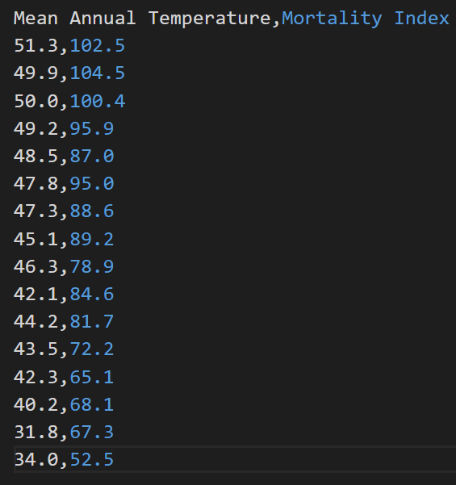
   
   Silahkan untuk diketikan isian data tersebut ke dalam berkas `neoplasms-breast-cancer.csv`

### _Load_ data ke _jupyter notebook_ dan mengubahnya ke dalam _numpy array_
4. Kembali ke berkas `resistant-line.ipynb`. Buat cell baru
   dan ketikkan perintah berikut untuk mengubah ukuran
   font dan transparansi _gridlines_
   ```py
   plt.rcParams.update(plt.rcParamsDefault)
   plt.rcParams.update({
      'font.size': 12,
      'grid.alpha': 0.25})
   ```

5. Load data ke dalam format `DataFame` menggunakan perintah berikut
   ```py
   df = pd.read_csv("./neoplasms-breast-cancer.csv")
   df
   ```
   Jika langkah di atas dijalankan dengan benar, maka akan ditampilkan 
   output sebagai berikut:

   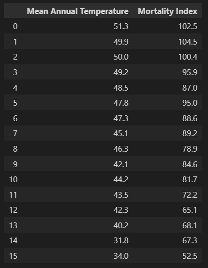

6. Ambil kolom `Mean Annual Temperature` and `Mortality Index`
   dan ubah ke dalam format `numpy.ndarray` menggunakan perintah berikut
   ```py
   temp_data = df["Mean Annual Temperature"].to_numpy()
   mort_data = df["Mortality Index"].to_numpy()
   ```

### Plot data
6. Selanjutnya kita lakukan plotting data menggunakan _scatterplot_.
   Seperti yang telah kita lakukan pada pertemuan sebelumnya.
   Urutan pembuata plot masih tetap sama, yaitu membuat dua object
   `fig` (figure) dan `ax` (axis), dengan objek `ax` akan kita isi
   dengan berbagai macam jenis plot, namun pada kasus kita saat ini,
   kita isi dengan `.plot()`.

   Setelah dilakukan plot, maka tahap berikutnya pengaturan label 
   untuk sumbu-x dan sumbu-y

   Dan baris terakhir adalah menampilkan objek `fig`.

   Semua penjelasan di atas dapat dijalankan dengan menggunakan perintah 
   berikut
   ```py
   fig, ax = plt.subplots(figsize=(4, 4))

   ax.plot(temp_data, mort_data, marker='o', linestyle="None", markersize=6,
         markerfacecolor="gray", markeredgecolor="k", alpha=.5)

   ax.set_xlabel("Temp")
   ax.set_ylabel("Mortality")

   plt.show(fig)
   ```

   Di dalam fungsi (atau method) `.plot()`, kita melakukan pembuatan 
   scatterplot dengan cara membuat:
   -  `marker='o'` - marker berbentuk lingkaran dengan isian warna dan tepi, 
   - `linestyle="None"` - kita tidak menggunakan _styling_ garis tertentu 
   sehingga tidak ditampilkan garis penghubung antara titik-titik data,
   - `markersize=6` - ukuran dari marker, 
   - `markerfacecolor="gray"` - warna dari isian marker, 
   - `markeredgecolor="k"` - warna dari tepi marker,
   - `alpha` - level transparansi dari warna isian dan tepi marker

   Jika langkah di atas dijalankan dengan benar, maka akan didapatkan hasil
   plotting sebagai berikut:

   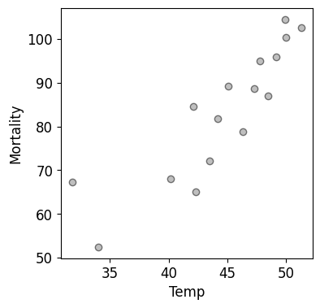

### Pembagian data menjadi tiga _batches_
7. Tahap berikutnya adalah membagi data menjadi tiga bagian (_batches_).
   Pembagian ini dapat dilakukan dengan cara menggunakan 
   operator _integer division_ pada Python `//` (double slashes)
   dan operator _modulo_ `%` (percentage)

   Pertama kita hitung sisa pembagian (_remainder_) 
   banyaknya data dengan angka 3
   yang dapat dicari dengan perintah `len(x_data) % 4`. Kita simpan hasil ini
   dalam variabel `rem`. Berikutnya adalah menghitung hasil bagi
   _integer division_ untuk mencari bilangan bulat terkecil `quotient`
   sedemikian rupa sehingga `quotient * 3 <= len(x_data)`.
   Hal ini dapat dilakukan dengan perintah `quotient = len(x_data) // 3`

   Setelah kita mendapatkan sisa pembagian `rem` dan `quotient`, 
   kita lakukan pengurutan (_sorting_) data dari kecil ke terbesar.
   Karena urutan `y_data` harus mengikuti urutan hasil _sorting_
   `x_data`, maka kita urutkan dulu `x_data`. Lalu kita ambil index urutannya
   dan kita terapkan ke `y_data`. Di dalam fungsi di bawah `divide_three_batches()`, proses ini diwakili dengan perintah
   ```py
   y_data = y_data[np.argsort(x_data, kind="stable")]
   ```
   Setelah itu, barulah kita mengurutkan `x_data`. Mungkin ada yang 
   bertanya, mengapa kita tidak mengurutkan terlebih dahulu `x_data`
   lalu `y_data`? Alasannya karena kita tidak ingin `x_data` urut
   terlebih dahulu, sebab jika `x_data` diurutkan terlebih dahulu
   maka kita tidak bisa mendapatkan indeks urutan `x_data` dan akhirnya
   `y_data` tidak dapat kita urutkan. [Silahkan dicoba untuk mengetahui 
   benar tidaknya argumen ini.]

   Dalam perintah di atas `np.argsort()` akan secara otomatis
   mencari urutan indeks yang membuat data menjadi terurut dari kecil ke
   besar, argument tambahan `kind="stable"` adalah jenis algoritma
   untuk pengurutan yang menjamin data-data dengan nilai yang sama
   tetap dipertahankan urutannya dari urutan sebelum data tersebut diurutkan.

   Tahap terakhir, kita buat tipe data _dictionary_ (berisi _key_ dan 
   _value_) dengan nama variabel `batches`. Variabel ini akan kita
   gunakan untuk menyimpan data di setiap _batch_. Keys dari
   variabel ini adalah 0, 1, dan 2 yang menunjukkan `left batch`,
   `middle batch`, dan `right batch` berturut-turut.
   Untuk setiap _key_ ini akan menyimpan _value_ dengan tipe
   data _dictionary_ lagi dengan dua keys: `x` dan `y` yang 
   mewakili koordinat x dan y dari tiap data di tiap _batch_.
   
   Dari sesi perkuliahan di kelas, 
   telah kita ketahui akan ada tiga kemungkinan sisa bagi banyaknya data 
   dengan angka tiga, yaitu: 0, 1, dan 2. Saat sisa bagi bernilai 1, 
   kita memiliki kelebihan satu _data point_ yang kita tempatkan ke
   _middle batch_ supaya banyaknya data untuk setiap _batch_ simetris.
   Jika sisa bagi bernilai 2, kita memiliki kelebihan dua _data point_ yang
   kita tempatkan dua kelebihan titik tersebut ke _left batch_ dan 
   _right batch_.

   Dalam fungsi di bawah ini (fungsi `divide_three_batches`), pembagian
   banyaknya data di setiap _batch_ diwakili dengan _control flow_ percabangan `if-else`.

   Pembagian data dilakukan dengan teknik _index slicing_ `x_data`
   dan `y_data`.

   ```py
   def divide_three_batches(x_data, y_data):
      rem = len(x_data) % 3
      quotient = len(x_data) // 3

      # -- first sort x_data and y_data order follow from it.
      y_data = y_data[np.argsort(x_data, kind="stable")]
      x_data = np.sort(x_data, kind="stable")

      batches = {}
      if rem == 0:
         batches[0] = {'x': x_data[:quotient],
                        'y': y_data[:quotient]}
         batches[1] = {'x': x_data[quotient:2*quotient],
                        'y': y_data[quotient:2*quotient]}
         batches[2] = {'x': x_data[2*quotient:],
                        'y': y_data[2*quotient:]}
      elif rem == 1:
         batches[0] = {'x': x_data[:quotient],
                        'y': y_data[:quotient]}
         batches[1] = {'x': x_data[quotient:2*quotient+1],
                        'y': y_data[quotient:2*quotient+1]}
         batches[2] = {'x': x_data[2*quotient+1:],
                        'y': y_data[2*quotient+1:]}
      elif rem == 2:
         batches[0] = {'x': x_data[:quotient+1],
                        'y': y_data[:quotient+1]}
         batches[1] = {'x': x_data[quotient+1: 2*quotient+1],
                        'y': y_data[quotient+1: 2*quotient+1]}
         batches[2] = {'x': x_data[2*quotient+1:],
                        'y': y_data[2*quotient+1:]}
      return batches

   ```

   Apabila tahap di atas dijalankan dengan benar, maka ketika mengetikkan 
   perintah berikut 
   ```py
   batches = divide_three_batches(temp_data, mort_data)
   batches
   ```
   di cell baru akan didapatkan hasil berikut di output cell

   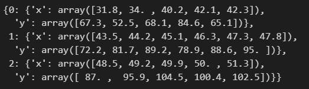

### Perhitungan median untuk setiap _batch_
8. Tahap selanjutnya adalah menghitung median arah sumbu-x dan 
   sumbu-y untuk setiap _batch_.
   Dari hasil variabel `batches` di langkah sebelumnya, kita bisa
   gunakan variabel tersebut untuk menghitung nilai median 
   sebagai berikut
   ```py
   median_each_batch = [
      [np.median(batches[i]['x']) for i in range(3)],
      [np.median(batches[i]['y']) for i in range(3)]]

   median_each_batch
   ```

   Jika langkah di atas dijalankan dengan benar maka akan didapatkan 
   hasil sebagai berikut

   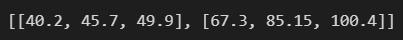

   Median setiap batch disimpan dalam bentuk matriks berukuran $2 \times 3$
   dengan masing-masing menunjukkan koordinat x dan y berturut-turut
   dan masing-masing kolom menunjukkan _left batch_, _middle batch_,
   dan _right batch_. 

### Perhitungan _slope_ dan _intercept_ resistant line
9. Selanjutnya, kita hitung _slope_ (kemiringan garis), $b$ dan 
   _intercept_ (titik potong dengan sumbu-y) $a$ dari _resistant line_
   $y = a + b\,x$. 
   Kedua besaran tersebut dapat dihitung dengan menggunakan rumus berikut
   $$
      b = \frac{y_r - y_\ell}{x_r - x_\ell}
   $$

   $$
      a = \frac{1}{3}\big[
            (y_\ell - b\,x_\ell) + (y_m - b\,x_m) + (y_r - b\,x_r) 
         \big]
   $$

   Rumus di atas dapat diubah dalam kode Python sebagai berikut
   ```py
   slope_b = (median_each_batch[1][2] - median_each_batch[1][0]) / (median_each_batch[0][2] - median_each_batch[0][0])
   intercept_a = np.mean([y - slope_b*x for x, y in zip(*median_each_batch)])
   slope_b, intercept_a
   ```

   Jika langkah di atas dijalankan dengan benar, maka akan didapatkan 
   hasil sebagai berikut:

   

### Perhitungan residual, $y - y_\textrm{resistant}$

10. Selanjut kita hitung residual, yaitu hasil dari pengurangan
    koordinat y dari data dengan nilai $y$ hasil estimasi _resistant line_.
    Secara umum dapat dirumuskan dalam bentuk
    $$
      (x_i^\textrm{res}, y_i^\textrm{res})
         =  \big(x_i, \,\,\underbrace{y_i - (a + b x_i)}_{y - y_\textrm{resistant}}\big)
    $$
    Implementasi perhitungan residual ke dalam kode Python dapat dilakukan
    sebagai berikut:
    ```py
    residual_batches = {
      k: {'x': v['x'],
          'y': v['y'] - (intercept_a + slope_b*np.array(v['x']))} 
      for k, v in batches.items()}

    [[residual_batches[i]["x"] for i in range(3)],
     [residual_batches[i]["y"] for i in range(3)]]
    ```

    Di dalam perhitungan variabel `residual_batches`, kita menggunakan 
    _list comprehension_ untuk tipe data _dictionary_.
    Pertama kita iterasi untuk setap `.items()` di dalam `batches`
    yaitu pasangan _key_ dan _value_ yang kita namakan variabel `k` dan `v`.
    Selanjutnya untuk variabel `v` ini, kita akses koordinate
    setiap _batch_ dengan perintah `v['x']` dan `v['y']`.
    Lalu kita buat dictionary baru di setiap nomor _batch_ (0: _left batch_,
    1: _middle batch_, 2: _right batch_), suatu tipe data _dictionary_
    yang memuat koordinat dari residual. Untuk koordinat x residual, 
    kita tidak perlu mengganti, sehingga cukup menuliskan 'x': v['x'].
    Namun untuk koordinat y residual, kita perlu menghitung
    nilai baru yaitu `y: v['y'] - (intercept_a + slope_b*np.array(v['x']))`

Jika langkah di atas dijalankan dengan benar, maka akan didapatkan hasil

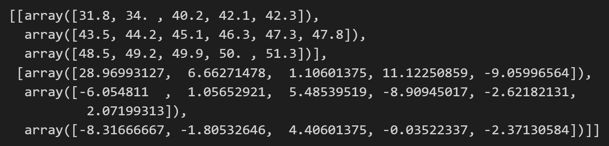

### Perhitungan _slope_ dan _intercept_ data residual

11. Sama seperti langkah pada perhitungan _slope_ dan _intercept_ untuk
    data awal (sebelum didapatkan residual), kita menggunakan rumus 
    berikut (rumus tetap sama hanya ditambahkan superscript _res_)
   $$
      b^\textrm{res} = \frac{y_r^\textrm{res} - y_\ell^\textrm{res}}{
         x_r^\textrm{res} - x_\ell^\textrm{res}}
   $$

   $$
      a^\textrm{res} = \frac{1}{3}\big[
            (y_\ell^\textrm{res} - b\,x_\ell^\textrm{res}) 
            + (y_m^\textrm{res} - b\,x_m^\textrm{res}) 
            + (y_r^\textrm{res} - b\,x_r^\textrm{res}) 
         \big]
   $$

   Sebelum perhitungan _slope_ dan _intercept_ tentu kita memerlukan 
   nilai median di setiap _batch_ dalam data residual. Sehingga implementasi
   rumus di atas ke dalam kode Python
   ```py
   median_residual_batch = [
      [np.median(residual_batches[i]['x']) for i in range(3)],
      [np.median(residual_batches[i]['y']) for i in range(3)]]

   residual_slope_b = (
      median_residual_batch[1][2] - median_residual_batch[1][0]) \
      / (median_residual_batch[0][2] - median_residual_batch[0][0])
   residual_intercept_a = np.mean(
      [y - residual_slope_b*x for x, y in zip(*median_residual_batch)])

   print(median_residual_batch)
   residual_slope_b, residual_intercept_a
   ```

Jika langkah di atas dijalankan dengan benar, maka akan ditampilkan dua
hasil berikut untuk median residual dan pasangan (_slope_, _intercept_)
untuk residual

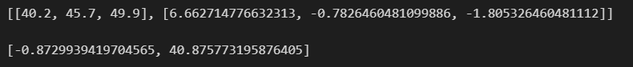

### Menyatukan langkah perhitungan _slope_ dan _intercept_ ke dalam fungsi 
12. Semua langkah-langkah yang telah kita lakukan dapat kita rangkum
    dalam suatu fungsi yang lebih rapi dengan nama `get_resistance_line()`.

    Disini fungsi tersebut akan diberikan sebagai suatu modul di dalam 
    direktori `eda/resistantline.py`. Silahkan dilihat dalam folder tersebut.

    Download direktori `eda` dan taruh di dalam direktori `week-04` (satu folder
    dengan `resistant-line.ipynb`)

    Untuk memanggil fungsi ini cukup tambahkan pada cell teratas
    di dalam _jupyter notebook_ yang telah kalian buat di sesi praktikum ini

    Sebagai contoh pemanggilan module `eda.resistantline.py`
    ```py
    import eda.resistantline as eda_rl
    ```

    Secara garis besar, _flowchart_ untuk perhitungan _slope_ dan _intercept_
    yang telah konvergen dapat dirangkum sebagai berikut:

    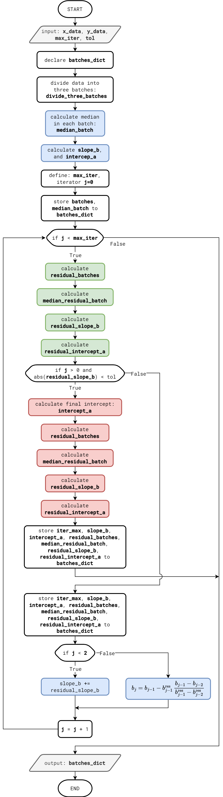

    Pada gambar di atas blok berwarna abu-abu menunjukkan input/output dari `get_resistant_line()`.
    Blok berwarna biru adalah untuk update _slope_ dan _intercept_ data original.
    Blok berwarna hijau adalah untuk update _slope_ dan _intercept_ data residual.
    Blok berwarna merah adalah untuk perhitungan terakhir _slope_ dan _intercept_
    data original dan data residual yang telah konvergen.


### Memanggil fungsi `get_resistant_line`
13. Setelah berhasil melakukan _load module_ `eda.resistantline.py`, maka langkah 
    berikutnya adalah menggunakan fungsi `get_resistant_line()`.

    Jalankan perintah berikut pada cell baru
    ```py
    batches_dict = eda_rl.get_resistance_line(temp_data, mort_data, max_iter=100, tol=1e-6)
    ```
    
    Argument pertama dari fungsi tersebut adalah `x_data` yang
    merupakan data pada sumbu-x `temp_data`, dan argument kedua
    adalah `y_data` yang merupakan data pada sumbu-y `mort_data`.
    Argument ketiga `max_iter` digunakan untuk mengatur limit iterasi
    maksimal supaya mencapai nilai _slope_ dan _intercept_ yang konvergen.
    Argument terakhir `tol` digunakan sebagai syarat henti
    _slope_ residual apakah sudah mendekati nilai nol cukup dekat.

    Perintah tersebut akan melakukan perhitungan _slope_ dan _intercept_
    untuk resistant line hingga dicapai nilai yang konvergen.
    Berikut hasil menjalankan fungsi `get_resistant_line()`

    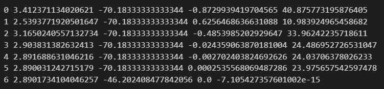

### Plot akhir nilai konvergen _slope_ dan _intercept_ untuk data dan residual

14. Langkah terakhir adalah membuat plot untuk data original dan residual 
    beserta _resistant line_-nya.  
    Disini kita akan memakai fungsi dari `eda_rl.plot_resistance_line()`.

    Untuk dapat menggunakan ini fungsi plot ini kita perlu menghitung beberapa 
    variabel berikut:
    - `x_data` - data untuk variabel di sumbu-x. Digunakan untuk pembuatan
      _scatterplot_.
    - `y_data` - data untuk variabel di sumbu-y. Digunakan untuk pembuatan 
      _scatterplot_.
    - `final_intercept` - _intercept_ terakhir dari perhitungan di _get_resistant_line_.
    - `final_slope` - _slope_ terakhir dari perhitungan di _get_resistance_line_
      _intercept_ untuk data original dan residual hingga konvergen
    - `reg_line` - merupakan _slope_ dan _intercept_ untuk metode OLS 
      (_Ordinary Least Square_). Boleh diisi atau tidak

   Berikut kode Python yang harus kalian ketikan
   ```py
   batches_dict = eda_rl.get_resistant_line(temp_data, mort_data, max_iter=100, tol=1e-6)

   final_slope, final_intercept = batches_dict[batches_dict["iter_max"]]["slope_intercept"]

   A = np.vstack([temp_data, np.ones(len(temp_data))]).T
   reg_line = np.linalg.lstsq(A, mort_data, rcond=None)[0]

   eda_rl.plot_resistance_line(temp_data, mort_data, final_intercept, final_slope, reg_line)
   ```

   Jika langkah-langkah dilakukan dengan benar, maka akan didapatkan gambar berikut

   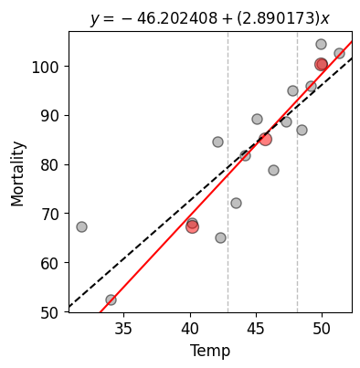

15. Untuk data residual dapat diketikan kode Python berikut yang sama
    dengan di langkah sebelumnya, namun kita perlu mengambil terlebih dahulu
    data residuals
    ```py
    iter_max = batches_dict["iter_max"]
    temp_data_residual = np.hstack(
      [batches_dict[iter_max]["residual_batches"][i]['x'] for i in range(3)])
    mort_data_residual = np.hstack(
      [batches_dict[iter_max]["residual_batches"][i]['y'] for i in range(3)])

    final_slope_residual, final_intercept_residual \
      = batches_dict[iter_max]["residual_slope_intercept"]

    A = np.vstack([temp_data_residual, np.ones(len(temp_data_residual))]).T
    reg_line = np.linalg.lstsq(A, mort_data_residual, rcond=None)[0]
    eda_rl.plot_resistance_line(temp_data_residual, mort_data_residual, 
                                final_intercept_residual, final_slope_residual,
                                reg_line)
    ```

    Jika langkah di atas dijalankan dengan benar maka akan didapatkan 
    gambar seperti berikut

    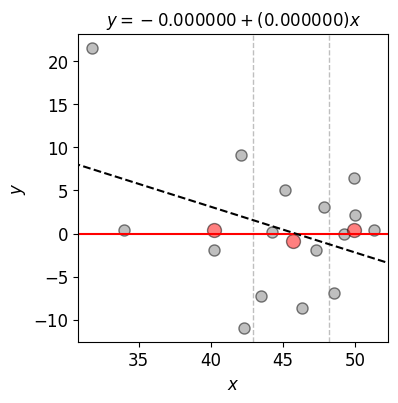

## (opsional) Re-expression data
Di bagian ini kita akan melakukan _transformasi_ data sehingga diperoleh 
kebergantungan linear antara dua variabel $x$ dan $y$ dalam data bivariate
yang kita gunakan

Untuk mencapai hal itu, kita menggunakan data dari [Velleman and Hoaglin, 1981](https://ecommons.cornell.edu/items/15b8588e-f941-4873-a252-34d8ab3159f3) Exhibits 5-11.
yang memberikan data ukuran mesin (dinyatakan dalam besaran pergeseran/_displacement_
dalam satuan _cubic inches_) dan jarak tempuh untuk setiap konsumsi volume 
bahan bakar (dalam satuan _miles per gallon_)

Panduan berikut tidak dituliskan secara lengkap seperti pada bagian sebelumnya.
Diharapkan pembaca dapat dengan mudah mengikuti panduan berikut dan tahu
bagaiman kode Python yang harus diketikkan dengan cara melihat panduan 
di bagian sebelumnya.

1. Berikut data yang diberikan, silahkan diketik ulang dan disimpan dengan 
   nama `mpg-displacement-1976.csv`

   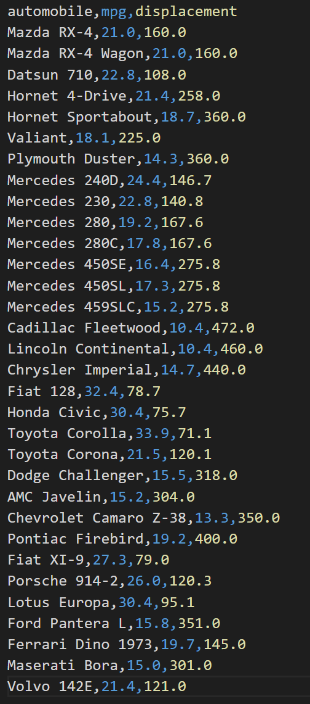

2. Buat file baru bernama `reexpression_with_resistance_line.ipynb`.
   Import tiga module utama `numpy`, `pandas`, dan `matplotlib`.
   Import juga module `eda` yang digunakan pada bagian sebelumnya

3. Bacalah data `mpg-displacement-1976.csv` menggunakan `pandas` dan 
   namakan objek DataFrame dengan variabel `df`.

4. Ambil kolom `displacement` dan `mpg` di dalam variabel `df`. Lalu nyatakan 
   dalam variabel `displace_data` dan `mpg_data`. Setelah itu panggil 
   fungsi `eda_rl.plot_3points` sebagai berikut

   ```py
   eda_rl.plot_3points(displace_data, mpg_data, x_label="disp", y_label="mpg")
   ```

   Jika langkah-langkah sebelumnya dijalankan dengan benar, maka akan didapatkan
   gambar tiga buah regresi yang menghubungkan median-median di setiap _batch_

   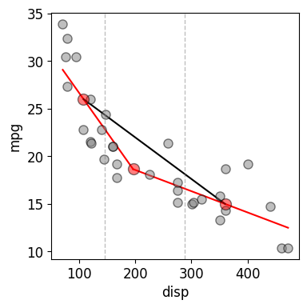

   Terlihat untuk data ini memiliki keterkaitan yang tidak linear.

5. Berikutnya kita akan melakukan _re-expression_ variabel ke dalam 
   variabel baru. Kita ubah variabel `mpg_data` ke dalam `1./mpg_data` yang
   menyatakan konsumsi bahan bakar yang dibutuhkan (dalam satuan _gallon_)
   per setiap mile-nya.
   Kita juga ubah variabel `displace_data` yang menyatakan ukuran volume mesin.
   Karena panjang berkaitan dengan akar pangkat tiga dari volume maka
   kita ambil angkat pangkat tiga `displace_data`. Namun kita telah membuat
   satu jarak di dalam `mpg_data` ke bagian penyebut. Sehingga kita memerlukan
   untuk membuat angkat pangkat tiga `displace_data` ini ke bagian penyebut.
   Sehingga kita dapat _re-expression_ untuk variabel `mpg_data` dan 
   `displace_data` sebagai berikut

   ```py
   reciproc_mpg_data = 1./mpg_data
   reciproc_cubic_root_dispace_data = displace_data**(-1./3)
   plot_3points(reciproc_cubic_root_dispace_data, reciproc_mpg_data,
                x_label="displacement^{-1/3}", y_label="gal/mi")
   ```

   Jika langkah-langkah di atas dijalankan dengan benar maka akan didapatkan
   gambar sebagai berikut

   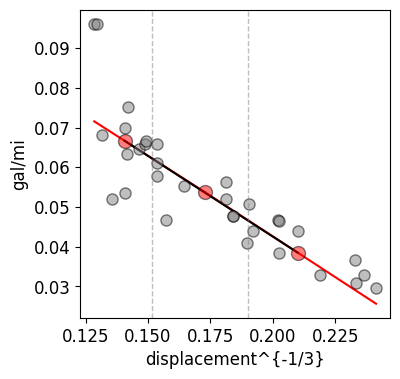

6. Terakhir jika kita jalankan program `get_resistant_line` pada data
   yang telah di-_re-expression_ ini menggunakan kode Python berikut
   ```py
   resistant_line = get_resistance_line(reciproc_cubic_root_dispace_data, 
                                        reciproc_mpg_data, max_iter=100, 
                                        tol=1e-6)

   final_slope, final_intercept \
      = resistant_line[resistant_line["iter_max"]]["slope_intercept"]

   A = np.vstack([reciproc_cubic_root_dispace_data, 
                  np.ones(len(reciproc_cubic_root_dispace_data))]).T
   reg_line = np.linalg.lstsq(A, reciproc_mpg_data, rcond=None)[0]
   
   eda_rl.plot_resistance_line(reciproc_cubic_root_dispace_data, 
                               reciproc_mpg_data, final_intercept, final_slope, 
                               reg_line=None, x_label="Displacement^{-1/3}",
                               y_label="gal/mi")
   ```
   kita akan dapatkan hasil sebagai berikut

   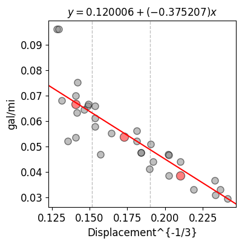

   Pada gambar di atas, garis regresi dari metode OLS tertutupi oleh _resistant line_.
   Kalian dapat mencoba untuk melanjutkan explorasi dengan membuat titik _outliers_
   yang ada di bagian pojok kiri atas.


## Self-exercise  
Tugas berikut tidak dikumpulkan, tetapi silahkan mengerjakan sendiri untuk
menambah pemahaman dan kemampuan.

1. Silahkan ubah perhitungan median, dari menggunakan `np.median()`
   ke `np.mean()`

2. Apa yang terjadi jika menggunakan dua _batches_?


