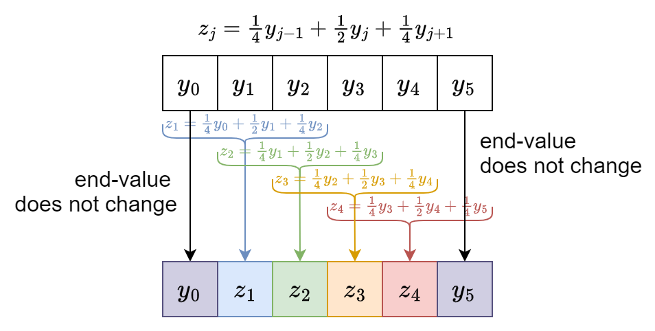

# Modul praktikum - Minggu 05 - Data Smoothing 

Dosen pengampu: **Henokh Lugo Hariyanto**; **Diana Nurlaily**   
Asisten mata kuliah: **Ukthi Nurul Isnaniah (16211028)**

**Tujuan**:
- Mampu melakukan proses _data smoothing_ dengan bahasa pemrograman Python 
- Mampu menjelaskan pola di dalam data menggunakkan kurva _smoothing_

> Tips belajar bahasa pemrograman adalah mengetik ulang perintah yang kita
> temukan di buku ataupun di internet, lalu kita ubah-ubah untuk menguji 
> pemahaman kita sudah tepat atau belum. Faktor bermain-main dan eskplorasi
> sangat diperlukan untuk memahami setiap perintah bahasa pemrograman yang
> kita pelajari. Setiap potongan kode di bawah dapat dijalankan secara lokal
> menggunakan VSCode dan Jupyter Notebook, atau menggunakan Google Collabs.

Panduan berikut diambil dari:
- [(Albert, 2023) - A Course in Exploratory Data Analysis](https://bayesball.github.io/EDA/)
- [(Velleman and Hoaglin, 1981) - Applications, Basics, and Computing of Exploratory Data Analysis](https://ecommons.cornell.edu/bitstreams/e5688170-b7d4-4e35-9ba0-ee51b3bed1b4/download)

Teknik data smoothing, merupakan teknik yang cukup populer terutama dalam
dunia _image processing_. Dengan teknik ini kita bisa mendapatkan gambar yang
lebih _smooth_ dalam pengertian menghilangkan _noise_ akibat kerusakan pixel.

Namun dalam perkuliahan/tutorial ini kita **TIDAK** mempelajari penerapan
_data smoothing_ terhadap data gambar tetapi ke data _time series_ atau 
menggunaan istilah yang lebih tepat adalah _sequences_. Disebut _sequences_
karena kita tidak terlalu memperhatikan nilai dari variabel di sumbu-x
dengan asumsi variabel tersebut sudah diurutkan berdasarkan urutan kejadian
(_chronological order_)

Kita juga akan menggunakan data jumlah pengunjung pertandingan
_baseball_ untuk tim [Atlanta Braves](https://www.mlb.com/braves)
pada musim pertandingan di tahun 1995.

## Data Smoothing 
Ide besar _data smooting_ adalah bagaimana kita dapat mempertahankan
pola trend yang lebih bebas daripada pola trend dari garis linear.
Kita juga ingin hasil kurva smoothing yang kita peroleh tetap memberikan
pola trend yang masih tidak dipengaruhi oleh ada tidaknya _outliers_.

Kita sudah belajar pada pertemuan sebelumnya bahwa _resistant line_ cukup
baik menggambarkan trend linear dari suatu data yang memiliki hubungan
linear apabila terdapat _outliers_. Jika _resistant line_ digunakan
untuk model linear, maka _data smoothing_ yang kita pelajari saat ini
digunakan untuk model _smoothing_ yang lebih umum dari garis linear.
Bisa disebut bahwa kurva _smoothing_ yang dihasilkan adalah model 
nonlinear.

Menurut (Velleman dan Hoaglin, 1981) ada dua prosedur smoothing
yang cukup baik diterapkan untuk data-data yang berfluktuasi tinggi
yaitu _smoothing procedure_ dengan kode: 
1. **3RSSH.twice**: 
   1. **"3R"**: _repeated running median of 3_
   2. **"SS"**: _two times splitting_
   3. **"H"**: _hanning smoothing_
   4. **".twice"**: apply 3RSSH to rough (residual data)
2. **4253H.twice**. 
   1. **"42"**: _running median of 4_ + _recentering median of 2_  
   2. **"5"**: _running median of 5_
   3. **"3"**: _running median of 3_
   4. **"H"**: _hanning smoothing_
   4. **".twice"**: apply 4253H to rough (residual data)

Namun pada tutorial ini, kita cukup mempelajari 
_smoothing procedure_ yang pertama. Di akhir tutorial kalian
diharapkan dapat menghasilkan kurva _smoothing_ sebagai berikut
dan juga akan diberikan bagaimana membaca hasil kurva _smoothing_
tersebut


Ada 6 tahapan yang akan buat dengan menggunakan Python untuk dapat
membuat _smoothing procedure_ **3RSSH.twice**:
1. _Running median of 3_ (dengan lebar jendela sebesar 3)
2. _End value smoothing_
3. _Repeated running median of 3_
4. _Splitting_
5. _Hanning_
6. _Reroughing_

Semua fungsi untuk melakukan _smoothing procedures_ sudah tersedia dalam 
berkas `eda/smoothing.py`.

1. Buatlah berkas _jupyter notebook_ dengan nama `smoothing-albert.ipynb`.
   Isi dengan modul Python untuk pengolahan _array_, tabel, _plotting_, dan  modul `eda/smoothing.py`berikut:
   ```py
   import numpy as np
   import pandas as pd
   import matplotlib.pyplot as plt
   import eda.smoothing as eda_smt
   ```

2. Bacalah data `./datasets/braves.attendance.txt` menggunakan Pandas
   dengan kode Python sebagai berikut:
   ```py
   df = pd.read_table("./datasets/braves.attendace.txt")
   df
   ```

3. Lakukan _plotting_ data yang sudah dipanggil tersebut menggunakan 
   Matplotlib
   ```py
   fig, ax = plt.subplots(figsize=[6, 4])

   ax.plot(df["Game"], df["Attendance"], marker='o', linestyle="None",
           markersize=4)

   ax.grid("on")
   ax.set_xlabel("Game")
   ax.set_ylabel("Attendance (x 100 people)")
   ax.set_title("Home attendance for the Atlanta Braves baseball team",
               fontsize="medium")

   plt.show(fig)
   ```

   Jika langkah-langkah di atas dijalankan dengan benar, maka akan didapatkan
   hasil sebagai berikut

   

## _Running median of 3_

Tahap _smoothing_ yang akan kita implementasikan ke dalam Python adalah
_running median of 3_. Teknik _smoothing_ ini mengambil secara terus menerus
tiga data berurutan dan kemudian dihitung nilai median dari tiga data tersebut.

Untuk lebih jelas dapat dilihat gambar berikut:


Pada contoh di atas terdapat 5 buah data yang akan kita lakukan _smoothing_
yaitu $(y_1, y_2, y_3, y_4, y_5)$. _Running median_ dihitung dengan cara
mengambil tiga data pertama $(y_1, y_2, y_3)$ lalu dihitung nilai median dari
tiga data tersebut dan didapatkan nilai _smoothing_, $z_1$. Kita lakukan
selanjutnya pada tiga data berikutnya dengan cara menggeser *window* ke kanan
sejauh satu satuan data yaitu data $(y_2, y_3, y_4)$ dan didapatkan nilai 
_smoothing_ $z_2$. Lakukan sampai *window* menyentuh ujung data terakhir ($y_5$).

Untuk contoh di atas terlihat ada titik data yang hilang pada ujung kiri dan
kanan. Untuk mengestimasi nilai _smooting_ data _endpoints_ tersebut
kita akan lanjutkan pada tahap berikutnya _end value smoothing_.

Implementasi proses _running median of 3_ ke dalam kode Python adalah 
sebagai berikut

```py
smooth3_noEnd = df["Attendance"].rolling(window=3, center=True).median()
smooth3_noEnd
```

Pada kode di atas, kita menggunakan _method_ yang disediakan oleh objek
`pandas.Series` untuk melakukan operasi _rolling_ (bahasa lain untuk _running_
dalam _running median_). Kemudian kita tambahkan opsi `center=True` untuk
membuat perhitungan akhir median menyisakan _end value_ NaN pada bagian pertama
dan terakhir. Lalu setelah kita menerapkan _method_ `.rolling()`, kita terapkan
fungsi yang akan kita gunakan selama proses _rolling_ yaitu `.median()`.

4. Tulis potongan kode di atas dalam berkas _jupyter notebook_ yang sudah
   dibuat pada tahap sebelumnya.

   Jika tahapan di atas dijalankan dengan benar makan akan ditampilkan hasil
   _running median of 3_ sebagian berikut

   


## _End value smoothing_
Pada tahap ini kita akan mengisi ujung pertama dan terakhir dari hasil 
di tahap sebelumnya yaitu indeks 0 dan 71 pada variabel `smooth3_noEnd`.

Untuk menentukan nilai _smooth_ dari _endpoints_ tersebut, kita perlu memahami
tiga buah kasus 


- **Case 1**. Nilai _end value_ berada diluar rentang dua kali selisih
  antara dua _smoothed data_ terdekat dari _end value_.
  Pada kasus ini, nilai _end value_ diestimasi nilai _smoothing_-nya
  sebagai batas terdekat dengan nilai _end value_. Batas ini merupakan 
  batas yang didapatkan dengan menambahkan atau mengurangi _smoothed data_
  terdekat pertama dengan dua kali nilai selisih dari dua _smoothed data_
  terdekat pertama dan kedua dari _end value_. Pada gambar di atas selisih
  dua nilai _smoothed data_ terdekat pertama dan kedua adalah $\Delta y$.
  Lalu batas atas dan bawah ditunjukkan pada interval garis vertikal
  yang memuat tulisan $2\Delta y$.

- **Case 2**. Nilai _end value_ berada didalam rentang dua kali selisih
  antara dua nilai _smoothed data_ terdekat pertama dan kedua dari _end value_.
  Pada gambar di atas terlihat titik berwarna biru berada dalam rentang
  inteval garis vertikal bertuliskan $2\Delta y$. Untuk kasus ini 
  nilai _smoothing_ untuk _end value_ adalah dirinya sendiri (tidak berubah)

- **Case 3**. Selisih antara nilai _smoothed data_ pertama dan kedua dari 
  _end value_ adalah nol. Pada kasus ini, nilai _smoothing_ untuk 
  _end value_ adalah nilai _smoothed data_ terdekat pertama.

Ketiga _cases_ di atas telah diimplentasikan ke dalam dua fungsi `get_evs()`
yang terdapat di dalam berkas `eda/smoothing.py`.

5. Kalian tidak perlu menuliskan ulang kode Pyton untuk `get_evs()`
   Cukup memanggil fungsi `apply_evs()` yang tersedia di dalam 
   modul `eda/smoothing.py`. Tuliskan kode Python berikut ke cell baru
   di dalam berkas _jupyter notebook_ yang sudah kalian buat
   ```py
   eda_smt.apply_evs(df["Attendance"].to_list(), smooth3_noEnd.to_list())
   df
   ```

   Jika tahap di atas dijalankan dengan benar, maka akan didapatkan
   hasil sebagai berikut untuk penerapan `apply_evs` ke variabel
   `smooth3_noEnd`. Terlihat nilai di indeks pertama dan terakhir sudah terisi
   dengan angka yang mengestimasi nilai _smoothing_ untuk _end values_.

   

## _Repeated running median of 3_

Dua tahap yang kita telah pelajari sebelumnya merupakan satu-kesatuan 
prosedur _smoothing_ yang disebut dengan kode **`3`** (gabungan
_running median of 3_ dan _end value smoothing_). Karena hasil yang didapatkan
setelah proses _smoothing_ ini memiliki panjang data yang sama, maka kita
bisa menerapkan prosedur _smoothing_ ini berkali-kali.
Jika kita terapkan prosedur **`3`** ini berkali-kali hingga tidak terjadi 
perubahan, maka proses yang kita lakukan dinamakan dengan kode **`3R`**.

Di dalam modul `eda/smoothing.py`, telah disediakan dua fungsi untuk melakukan
smoothing dengan kod **`3`** dan dengan kode **`3R`** yaitu
`apply_3()` dan `apply_3R()`.

6. Jalankan `apply_3()` dan `apply_3R()` dari modul `eda/smooting` terhadap
   DataFrame `df` yang telah didefinisian di tahapan sebelumnya.
   Kalian dapat mengetikan perintah berikut

   ```py
   df["Smooth3"] = eda_smt.apply_3(df["Attendance"].to_numpy())
   df["Smooth3R"] = eda_smt.apply_3R(df["Attendance"].to_numpy())[1]
   df
   ```
   
   Terdapat indeks `[1]` dalam fungsi _smoothing_ kode **`3R`**, karena
   dalam implementasi kode Python terdapat dua output yang pertama 
   (indeks `[0]`) menyatakan
   indeks saat kapan proses _smoothing_ **`3`** konvergen, output yang
   kedua (indeks `[1]`) hasil _smoothing_. Dan kita cukup menggunakan
   output yang kedua.

7. Lakukan _plotting_ untuk kolom `df["Smooth3"]` dan `df["Smooth3R"]`
   menggunakan Matplotlib. Gunakan kode Python berikut:
   
   ```py
   fig, ax = plt.subplots(figsize=[8, 4])

   ax.plot(df["Game"], df["Attendance"], marker='o', linestyle="None",
           markersize=4, zorder=2, label=None)
   ax.plot(df["Game"], df["Smooth3"], linestyle="-", linewidth=1, alpha=1,
           zorder=2, label="3")
   ax.plot(df["Game"], df["Smooth3R"], linestyle="-", linewidth=1, alpha=1,
           zorder=3, label="3R")

   ax.grid("on")
   ax.set_xlabel("Game")
   ax.set_ylabel("Attendance (x 100 people)")
   ax.set_title("Home attendance for the Atlanta Braves baseball team",
                fontsize="medium")
   ax.legend(loc="best")

   plt.show(fig)
   ```

   Jika tahapan di atas dilakukan dengan benar, maka akan didapatkan tabel 
   dan gambar sebagai berikut

   <table>
     <tr>
       <td> 
       <td> 
   </table>

## _Spliting_
Jika kita lihat hasil tahap sebelumnya (kurva warnah hijau), kita
menemukan ada puncak-puncak datar dan lembah-lembah datar.
Pada tahap _splitting_ ini kita akan melakukan _smoothing_ dan 
hanya berfokus pada _2-high peaks_ dan _2-low valleys_.

Ilustrasi di bawah ini menunjukkan kondisi data saat terjadi 
_2-high peaks_ dan _2-low valleys_

<table>
  <tr>
    <td> 
    <td> 
</table>


_2-high peaks_ terjadi saat ada dua puncak yang memiliki nilai yang sama namun nilai di sekeliling dua puncak tersebut lebih rendah. 
_2-low valleys_ terjadi saat ada dua lembah yang memiliki nilai yang sama namun
nilai di sekeliling dua lembah tersebut lebih tinggi.

Pada gambar _zoom in_ kurva _smoothing_ **`3R`**, terlihat ada dua buah
_2-high peaks_ dan satu buah _2-low-valleys_. Perlu diperhatikan harus
terdapat dua nilai yang sama dan dikeliling oleh dua nilai yang lebih besar
dari dua puncak yang sama itu. Jika terdapat tiga puncak atau lebih yang
bernilai sama, maka bukan disebut _2-high peaks_.

Ada tiga _subprocedure_ untuk dapat melakukan proses _splitting_, yaitu: 1) 
perlu mengidentifikasi lokasi _2-high peaks_ dan _2-low valleys_; 2) melakukan
pemisiahan _left sequence_ dan _right sequence_ berdasarkan lokasi
_2-high peaks_ dan _2-low valleys_. Untuk _left sequence_ dilakukan 
_end value smoothing_ di ujung kanan. Untuk _right sequence_ dilakukan 
_end value smoothing_ di ujung kiri. Setelah itu, kedua _sequences_ digabung.
Berikut ilustrasi untuk proses _splitting_


Dalam tutorial ini tidak akan dijelaskan secara detail implementasi 
proses _splitting_ ke dalam kode Python, namun kalian dapat melihat 
implementasi tersebut dalam kode Python sebagai fungsi `scan_peak_or_valley()`,
`apply_evs_in_split()` dan `apply_S()` di dalam modul `eda/smoothing.py`.

8. Jalankan kode berikut untuk melakukan proses _splitting_ terhadap hasil
   yang didapatkan dari langkah sebelumnya yaitu hasil dari proses _smoothing_
   dengan kode **`3R`**.

   ```py
   df["Smooth3RSS"] = eda_smt.apply_S(
    eda_smt.apply_S(
      df["Smooth3R"].to_numpy()))
   df
   ```

   Kode di atas akan menjalankan dua kali proses _splitting_.

9. Buatlah plot untuk kolom `df["Smooth3RSS"]` menggunakan kode Python
   berikut ini

   ```py
   fig, ax = plt.subplots(figsize=[8, 4])

   ax.plot(df["Game"], df["Attendance"], marker='o', 
         linestyle="None", markersize=4, zorder=2, label=None)
   ax.plot(df["Game"], df["Smooth3R"], linestyle="-", 
         linewidth=1, alpha=1, zorder=3, label="3R") 
   ax.plot(df["Game"], df["Smooth3RSS"], linestyle="-", 
         linewidth=1, alpha=1, zorder=3, label="3RSS")

   ax.grid("on")
   ax.set_xlabel("Game")
   ax.set_ylabel("Attendance (x 100 people)")
   ax.set_title("Home attendance for the Atlanta Braves baseball team",
               fontsize="medium")
   ax.legend(loc="best")

   plt.show(fig)
   ```

   Jika langkah di atas dijalankan dengan benar, maka akan didapatkan
   hasil sebagai berikut

   <table>
     <tr>
       <td> 
       <td> 
   </table>

## _Hanning_
Jika kalian mencoba untuk menjalankan proses _smoothing_ dengan kode 
**`3R`** dan **`S`** berkali-kali, maka kalian tidak akan mendapatkan
perubahan lagi terhadap kurva _smoothing_ yang telah kalian didapatkan
(silahkan dicoba jika penasaran).

Pada tahap sebelum ini, semua jenis _smoothing_ yang didasarkan pada
median sudah tidak memiliki pengaruh yang signifikan atau hampir bisa dikatakan
tidak ada pengaruh _smoothing_ yang didapatkan.

Untuk itu diperlukan proses _smoothing_ yang masih bisa diterapkan untuk data
seperti contohnya adalah data yang bersifat monotone. Data yang bersifat 
monotone ini adalah data yang selalu naik (bisa sama) namun tidak pernah turun
atau lebih kecil dari nilai sebelumnya. Data-data semacam ini tentunya
apabila dilakukan proses _smoothing_ dengan kode **`3R`** dan _splitting_, pastinya tidak akan berubah.

Disini kita akan menggunakan prosedur _smoothing_ yang dinamakan _hanning_ 
(berasal dari dari nama seorang ahli klimatologi, [Julius von Hanning](https://www.encyclopedia.com/science/dictionaries-thesauruses-pictures-and-press-releases/hann-julius-ferdinand-von))

Ilustrasi prosedur _hanning_ adalah sebagai berikut



Untuk setiap tiga data berurutan, dilakukan reduksi dengan cara menghitung
_weighted average_ dengan rumus

$$
   z_j = \frac{1}{4}y_{j-1} + \frac{1}{2}y_j + \frac{1}{4}y_{j+1}
$$

$z_j$ adalah hasil dari prosedur _hanning_. Perlu diketahui bahwa
bobot $(\frac{1}{4}, \frac{1}{2}, \frac{1}{4})$ dapat diganti dengan bobot 
lain asal total dari bobot tersebut masih bernilai satu. Misal 
diganti dengan bobot $(\frac{1}{8}, \frac{3}{4}, \frac{1}{8})$.
Atau bisa juga menggunakan lima buah data sebagai contoh

$$
   z_j = \frac{1}{12}y_{j-2} + \frac{1}{4} y_{j-1} + \frac{2}{3} y_j
         + \frac{1}{4}y_{j+1} + \frac{1}{12}y_{j+2}
$$

Dari ilustrasi di atas, untuk menentukan nilai _smoothing_ untuk _end values_,
kita hanya cukup meng-_copy_ nilai _end values_ menjadi nilai _smoothing_ 
tanpa perlu mengubah apapun.

Implementasi prosedur _hanning_ dengan kode Python hampir sama
dengan implementasi prosedur _running median of 3_, namun disini kita
menggunakan _custom function_
```py
lambda s: 0.25*s.iloc[0] + 0.5*s.iloc[1] + 0.25*s.iloc[2]
```
Silahkan lihat fungsi `apply_H()` di dalam modul `eda/smoothing.py`.

10. Melanjutkan tahap sebelumnya, tentukan hasil _smoothing_ menggunakan
    prosedur _hanning_ dengan cara memanggil fungsi `apply_H` dengan
    menggunakan kode Python berikut
    ```py
    df["Smooth3RSSH"] = eda_smt.apply_H(df["Smooth3RSS"])
    df
    ```

11. Lakukan plotting untuk kolom `df["Smooth3RSSH"]` menggunakan kode Python
    berikut
    ```py
    fig, ax = plt.subplots(figsize=[8, 4])

    ax.plot(df["Game"], df["Attendance"], marker='o', linestyle="None",
            markersize=4, zorder=2, label=None)
    ax.plot(df["Game"], df["Smooth3RSS"], linestyle="-", linewidth=1, 
            alpha=1, zorder=3, label="3RSS")
    ax.plot(df["Game"], df["Smooth3RSSH"], linestyle="-", linewidth=1, 
            alpha=1, zorder=3, label="3RSSH")

    ax.grid("on")
    ax.set_xlabel("Game")
    ax.set_ylabel("Attendance (x 100 people)")
    ax.set_title("Home attendance for the Atlanta Braves baseball team",
                fontsize="medium")
    ax.legend(loc="best")

    plt.show(fig)
    ```

    Jika tahap di atas dilakukan dengan benar maka akan didapatkan hasil 
    sebagai berikut

    <table>
      <tr>
       <td> 
       <td> 
    </table>

   Dapat kita lihat dari kurva _smoothing_ dengan kode **`3RSSH`**
   lebih _smooth_ (ada sedikit alur belokan yang jelas di bagian puncak).
   Perlu dinginat prosedur _hanning_ ini dilakukan setelah prosedur
   _smoothing_ yang tidak sensitif dengan _outlier_ telak dilakukan.
   Jika prosedur _hanning_ ini dilakukan sebelum _smoothing_ yang menggunakan
   median, bisa dipastikan hasil kurva _smoothing_ akan sangat dipengaruhi
   dengan ada tidaknya _outlier_.

## _Reroughing_

Tahapan terakhir dari prosedur _smoothing_ adalah _reroughing_. Sebenarnya
ini bukan tahapan terakhir untuk prosedur _smoothing_ secara umum, 
namun adalah tahapan terakhir dalam prosedur _smoothing_ dengan kode 
**`3RSSH.twice`**

Sepertinya halnya estimasi trend suatu data dengan model yang dapat dirumuskan
dengan 
$$
   \textrm{DATA} = \textrm{FIT} + \textrm{RESIDUAL}
$$
maka untuk prosedur _smoothing_, kita memiliki istilah baru (namun maksudnya
masih sama)
$$
   \textrm{DATA} = \textrm{SMOOTH} + \textrm{ROUGH}
$$
Jadi _rough_ sendiri adalah _residual_ atau error yang didapatkan setelah
ditentukan kurva _smoothing_.

Dari nama prosedur _reroughing_, kita dapat memahami bahwa sebenarnya
prosedur ini adalah melakukan perhitungan ulang _rough_ dengan cara
melakukan prosedur _smoothing_ ke data _rough_ dengan kode _smoothing_
yang sama.

Sebagai contoh untuk kasus yang kita lakukan adalah prosedur _smoothing_
dengan kode **`3RSSH`** yang kita kenakan kepada data awal. Untuk prosedur _reroughing_
ini kita lakukan prosedur _smoothing_ dengan kode **`3RSSH`** ke data _rough_ 
(`rough = df["Attendance"] - df["Smooth3RSSH"]`).

Lalu setelah kita mendapatkan kurva _smoothing_ untuk data _rough_, kita 
tambahkan kurva _smoothing_ tersebut, ke kurva _smoothing_ yang kita
dapatkan untuk data awal. Secara matematis dapat kita tuliskan sebagai berikut

$$
\begin{align*}
  \textrm{DATA} &= \textrm{SMOOTH} + \textrm{ROUGH} \\
    &= \textrm{SMOOTH} + \left( \textrm{SMOOTHED ROUGH} + \textrm{ROUGH ROUGH} \right) \\
    &= \left(\textrm{SMOOTH} + \textrm{SMOOTHED ROUGH}\right) + \textrm{ROUGH ROUGH} \\
    &= \textrm{FINAL SMOOTH} + \textrm{ROUGH ROUGH}
\end{align*}
$$

Yang akan kita hitung adalah 
$$
   \textrm{FINAL SMOOTH} = \textrm{SMOOTH} + \textrm{SMOOTHED ROUGH}
$$

Karena kita sudah memiliki semua prosedur _smoothing_, kita hanya
perlu mengganti awalan data. Sebelumnya kita mengunakan data yang 
belum dilakukan prosedur _smoothing_ (data awal), untuk prosedur _reroughing_
ini kita menggunakan data _rough_ dan kita jalankan prosedur _smoothing_
dengan kode **`3RSSH`**. Karena kita hanya mengulang prosedur yang telah
dilakukan pada data awal, kita cukup menuliskan dengan kode **`.twice`** 
yang berarti dilakukan dua kali namun dilakukan pada data _rough_.

Di dalam modul `eda/smoothing.py` sudah didefinisikan prosedur _smoothing_
untuk kode **`.twice`** namun dengan input arguments data awal, data
_rough_, dan urutan kode _smoothing_.

12. Lakukan proses _reroughing_ dengan menjalankan kode Python berikut
    ```py
    df["Smooth3RSSH.twice"] = eda_smt.apply_twice(
      df["Attendance"], df["Smooth3RSSH"], seq="3R_S_S_H")
    df
    ```

    Pada bagian `seq="3R_S_S_H"` penulisan prosedur _smoothing_ harus 
    dipisahkan oleh tanda _underscore_ supaya membantu program
    untuk menentukan urutan prosedur _smoothing_.

13. Jalankan kode Python berikut untuk melakukan plotting kolom
    `df["Smooth3RSSH.twice"]`
    ```py
    fig, ax = plt.subplots(figsize=[8, 4])

    ax.plot(df["Game"], df["Attendance"], marker='o', linestyle="None",
            markersize=4, zorder=2, label=None)
    ax.plot(df["Game"], df["Smooth3RSSH"], linestyle="-", linewidth=1, 
            alpha=1, zorder=3, label="3RSSH")
    ax.plot(df["Game"], df["Smooth3RSSH.twice"], linestyle="-", linewidth=1, 
            alpha=1, zorder=3, label="3RSSH.twice")

    ax.grid("on")
    ax.set_xlabel("Game")
    ax.set_ylabel("Attendance (x 100 people)")
    ax.set_title("Home attendance for the Atlanta Braves baseball team",
                fontsize="medium")
    ax.legend(loc="best")

    plt.show(fig)
    ```
   
   Jika tahapan di atas dijalankan dengan benar, maka akan didapatkan 
   hasil sebagai berikut

   <table>
     <tr>
      <td> 
      <td> 
   </table>

   Jika kita lihat dengan seksama untuk kurva _smoothing_ dengan kode
   **`3RSSH.twice`**, terdapat perbedaan dengan sebelum proses
   _reroughing_ yang mana beberapa puncak dan lembah ada yang
   ditambahkan lagi beberapa _rough_ di puncah atau lembah.

## Analisis _smoothed curve_

Dari gambar kurva _smoothing_ yang diperoleh pada langkah sebelumnya 
kita dapatkan beberapa pola
- Pengunjung pertandingan _baseball_ mengalami penurunan tiba-tiba
  di awal musim pertandingan (antara Game 5 sampai 10) setelah euforia
  sesaat di awal pertandingan sudah mulai berkurang 
- Namun setelah penurunan itu, jumlah pengunjung perlahan-lahan naik
  dari Game 10 hingga Game 50.
- Jumlah pengunjung mencapai puncaknya pada Game 50, kemudian
  jumlah pengunjung turun drastis hingga menuju bentuk palung di sekitaran
  Game 60. Ada kemungkinan tim _baseball_ Atlanta Braves sudah mendapatkan
  poin yang cukup untuk dikatakan sebagai juara, sehingga pertandingan
  berikutnya sudah tidak menarik lagi.
- Ada kenaikan jumlah pengunjung sangat drastis di akhir musim. Pada titik
  ini mungkin para fans Atlanta Braves mulai antusias menanti dimulainya
  awal musim berikutnya.

14. Kita akan membuat plot $\textrm{ROUGH ROUGH}$ dari data yang kita
    telah cari $\textrm{FINAL SMOOTH}$-nya. Berikut kode Python untuk 
    menghasilkan plot $\textrm{ROUGH ROUGH}$

    ```py
    fig, ax = plt.subplots(figsize=[8, 4])

    df["FinalRough"] = df["Attendance"] - df["Smooth3RSSH.twice"]
    ax.plot(df["Game"], df["FinalRough"], marker='o', 
          linestyle="None", markersize=4, zorder=2, label=None)

    ax.grid("on")
    ax.set_xlabel("Game")
    ax.set_ylabel("Final Rough (x 100 people)")
    ax.set_title("Home attendance for the Atlanta Braves baseball team",
                fontsize="medium")

    plt.show(fig)
    ```

    Jika tahap di atas dijalankan dengan benar, maka akan didapatkan 
    plot sebagai berikut

    

    Dari plot $\textrm{ROUGH ROUGH}$ atau `FinalRough` di atas
    dapat diceritakan beberapa pola
    - Ada beberapa tanggal (tepatnya di 9 Game)
      yang memiliki jumlah pengunjung cukup 
      besar di sekitaran +/- 10,000 pengunjung. Ada kemungkinan
      alasan ini mengapa jumlah pengunjung sangat tinggi adalah
      pertandingan mungkin diadakan pada hari libur yaitu Sabtu dan Minggu.
    - Ada satu tanggal dengan jumlah pengunjung sangat kecil dibandingkan
      dengan jumlah pengunjung normalnya. Jumlah pengunjung normal
      adalah nilai kurva _smoothing_. Ada kemungkinan terkait cuaca
      yang ekstrem sehingga jarang pengunjung yang datang
    - Tidak ada pola yang cukup menarik dari plot `FinalRough`.
      Sebagian besar jumlah pengunjung berfluktuasi dari jumlah pengunjung
      normal di kisaran -50,000 hingga +50,000.

## [Opsional] Prosedur _smooting_ **4253H.twice**

Tahapan di bagian ini tidaklah wajib. Jadi boleh diabaikan.

Didalam modul `eda/smoothing.py` terdapat fungsi untuk prosedur smoothing
dengan kode **`42`** dan **`5`** yang dinyatakan dengan fungsi
`apply_42()` dan `apply_5`. Silahkan dicoba menggunakan data yang digunakan
pada tutorial di atas bagi yang memiliki rasa ingin tahu terkait 
prosedur _smoothing_ yang lain.


## Tugas (Exercise 03)
> Laporan harus ditulis dan dikumpulkan dalam bentuk berkas _markdown_ 
> (berekstensi `.md`). Apabila laporan memuat lebih dari satu beras, misal
> memuat gambar `.png` atau `.jpg`, maka berkas disatukan menjadi berkas 
> `.zip`. **PASTIKAN** berkas `.md` sudah dilakukan _preview_, sehingga kod
> `markdown` bisa di-_preview_ dengan benar di VSCode. Format penamaan file: 
> `NIM_NAMA.md` atau `NIM_NAMA.zip`  (boleh nama lengkap atau nama panggilan).
>
> **Contoh format laporan atau jawaban (`NIM_NAMA.md`)**
> Nama: [NAMA LENGKAP]
> NIM: [NIM]
> 1. (Jawaban nomor 1)
> 2. (Jawaban nomor 2)

1. [30 poin]
   Bacalah literatur kedua yang disebutkan di awal tutorial (Velleman and Hoaglin, 1981)
   dan jelaskan prosedur _smoothing_ dengan kode **`4253H.twice`**.

2. [70 poin] 
   Terapkan prosedur _smoothing_ di atas (**`3RSSH.twice`**)
   untuk data suhu sapi yang diukur setiap 5 menit (sumber data: [(de Alba and Zartman, 1979) page 137](https://archive.org/details/analysingtimeser0000unse)

   
   
   [Hint] Data dibaca dari kiri ke kanan lalu dari atas ke bawah.
   Kurangi setiap nilai diatas dengan 800 untuk mendapatkan
   suhu sapi. Gunakan sumbu-x dengan periode dari 1 hingga total data.
