# Moul praktikum - Minggu 06 - Median polish

Dosen pengampu: **Henokh Lugo Hariyanto**; **Diana Nurlaily**   
Asisten mata kuliah: **Ukthi Nurul Isnaniah (16211028)**

**Tujuan**:
- Mampu melakukan visualisasi proses perhitungan median polish
- Mampu melakukan interpretassi terhadap hasil dari median polish

> Tips belajar bahasa pemrograman adalah mengetik ulang perintah yang kita
> temukan di buku ataupun di internet, lalu kita ubah-ubah untuk menguji 
> pemahaman kita sudah tepat atau belum. Faktor bermain-main dan eskplorasi
> sangat diperlukan untuk memahami setiap perintah bahasa pemrograman yang
> kita pelajari. Setiap potongan kode di bawah dapat dijalankan secara lokal
> menggunakan VSCode dan Jupyter Notebook, atau menggunakan Google Collabs.

Di dalamn pertemuan ini kita akan membahas mengenai _median polish_ yang
merupakan perluasan dari teknik _median filtering_ untuk data _trivariate_ 
(3 variables)

Mengingat kembali tabel berikut untuk lebih mudah memahami median polish

| jenis data dan teknik | ilustrasi data |
|-----------------|----------------|
| univariate, median | 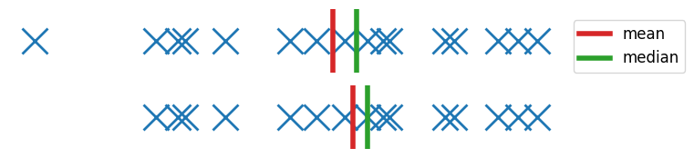|
| bivariate, resistant line | 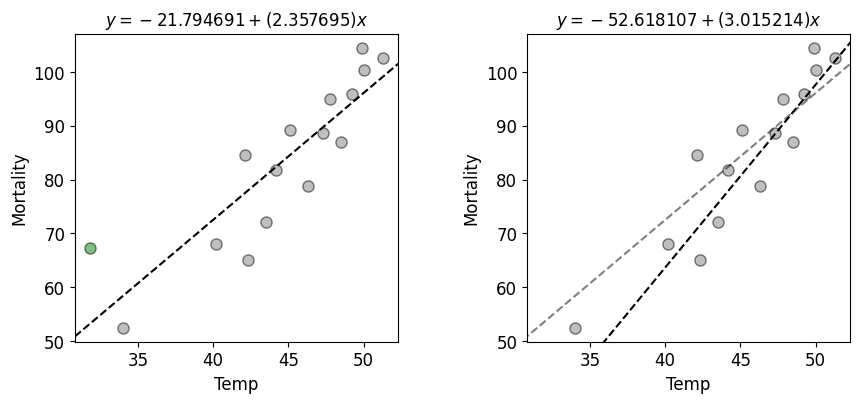 |
| bivariate, smoothing | 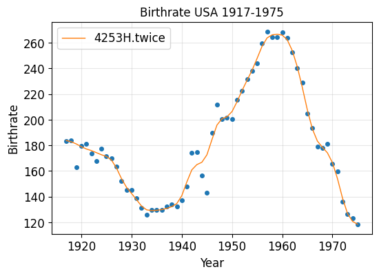 |
| trivariate, median polish | 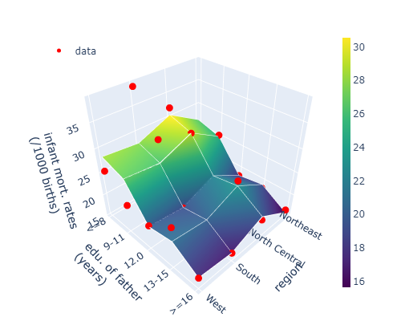

Pembahasan dalam modul ini akan menekankan lebih ke penggunaan modul 
`eda/medianpolish.py` beserta interpretasi hasil yang bisa didapatkan 
dari estimasi model yang diperoleh dari proses _median polish_

## Median polish

Teknik _median polish_ merupakan teknik yang cukup lama digunakan oleh ahli
statistik. Dimulai dari penggunaan _additive model_ yang digunakan 
di [(Brown and Mood, 1951)](https://digitalassets.lib.berkeley.edu/math/ucb/text/math_s2_article-12.pdf). Lalu di dalam buku fenomenal [(Tukey, 1977) - _Exploratory data analysis_](https://archive.org/details/exploratorydataa0000tuke_7616)

_Additive model_ merupakan model yang dirumuskan sebagai berikut
$$
  \textrm{data}_{ij}
    = \textrm{common effect} + \textrm{row effect}_i
      + \textrm{column effect}_j + \textrm{residual}_{ij}
$$

Disebut _additive_ karena setiap komponen diruas kanan disatukan dengan cara
dijumlah. Atau dalam bahasa lainnya, data kita lakukan dekomposisi penjumlahan
untuk setiap komponen-komponen di ruas kanan.

Yang akan kita cari dalam proses _median polish_ adalah komponen-komponen 
yang ada dalam ruas kanan di persamaan di atas. Secara garis besar, kita
akan melakukan _polish_ dengan menggunakan perhitungan _median_ untuk 
setiap baris dan kolom, hingga didapatkan nilai _residual_ yang sudah tidak
berubah atau stabil atau menuju 0.

Proses _median polish_ akan dibagi dalam beberapa langkah yang akan kalian
ikuti dalam bagian berikutnya

## Pembacaan data

1. Pertama-tama kita akan membaca data `infant-mortalilty-rates-orig.csv` yang
   berada dalam direktori `datasets`. Buat berkas baru _jupyter notebook_
   dengan nama `median-polish.ipynb`. _Copy_ direktori `eda` dan letakkan sederajat
   (dalam direktori yang sama dengan berkas _jupyter notebook_)

2. Import tiga module utama dan `eda/medianpolish.py` dengan mengetikan 
   kode Python berikut
   ```py
   import numpy as np
   import matplotlib.pyplot as plt
   import pandas as pd
   
   import eda.medianpolish as eda_mdpl
   ```

3. Tambahkan perintah berikut untuk mengatur ukuran _font_ dan warna 
   _gridlines
   ```p
   plt.rcParams.update(plt.rcParamsDefault)
   plt.rcParams.update({
     'font.size': 12,
     'grid.alpha': 0.3})
   ```

4. Bacalah data `infant-mortality-rates-orig.csv` dengan menggunakan 
   `pandas` sebagai berikut
   ```py
   df = pd.read_csv("./datasets/infant-mortality-rates-orig.csv")
   arr_infant = df.values[1:, 1:].astype(float)
   region_label = list(df.iloc[1:, 0].values.astype(str))
   father_edu_label= list(df.iloc[0, 1:].values.astype(str))
   ```

   Pada kode di atas, kita membaca data `.csv` dengan `pd.read_csv`. 
   Lalu kita ambil hanya bagian `[1:, 1:]` yaitu dari indeks 1 hingga terakhir
   untuk kolom dan baris. Scara lebih jelas lihat gambar berikut

    

   Dan juga dalam kode di atas, dilakukan pembacaan data untuk label baris
   (`region_label`) dan label kolom (`father_edu_label`)

5. Tahap berikutnya adalah membuat plot _heatmap_ untuk data di atas.
   Menggunakan modul `eda/medianpolish.py`, ketikkan perintah berikut ke
   cell baru di berkas _jupyter notebook_ yang telah kalian buat di langkah
   sebelumnya
   ```py
   fig, ax = plt.subplots(figsize=(4, 4))
   eda_mdpl.plot_polish(arr_infant, region_label, father_edu_label, ax,
                       sweep_flag=0)
   plt.show(fig)
   ```
   Perlu diingat dalam fungsi _plotting_ `.plot_polish()`, terdapat argument
   `sweep_flag` yang harus diisi `0` untuk menunjukkan bahwa kita 
   menggunakan data yang belum di-_sweep_ dan juga dilakukan peletakan _row medians_ 
   dari kanan ke kiri, _column medians_ dari bawah ke atas, dan _common effect_
   dari pojok kanan bawah ke pojok kiri atas.

   Jika semua langka dijalankan dengan benar, maka akan diperoleh gambar berikut
   
   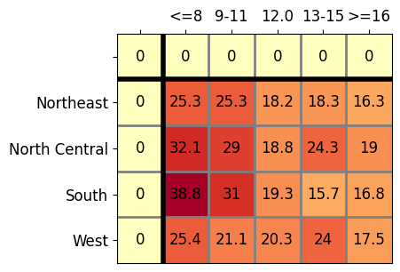

   Dari gambar di atas terlihat nilai _row medians_ (di kolom `0`), _column medians_ 
   (di baris `0`), dan _common effect_ (di cell `[0, 0]`) masih bernilai nol
   karena kita belum melakukan perhitungan _medians_ dalam proses _median polish_.

## Sweep 1
Dalam langkah ini akan dilakukan perhitungan medians sepanjang kolom untuk
semua baris. Lalu medians tersebut disebut _row medians_ dan dikurangkan terhadap
tabel (nilai data yang ada di bawah dan di kanan garis hitam tebal, lihat 
plotting pada tahap sebelumnya)

Untuk memahami proses Sweep 1 ini, pahami ilustrasi berikut

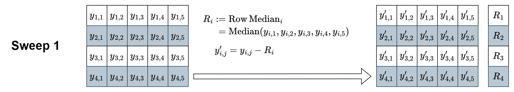

Pada langkah-langkah berikutnya, kita tidak akan menghitung satu-satu
dengan menuliskan kode Python satu-satu untuk setiap _sweep_, melainkan kita
akan menggunakan modul yang sudah dibuat untuk melakukan proses _median polish_.
Semua hasil _sweep_ secara otomatis dapat kita hitung semua menggunakan 
modul `eda/medianpolish.py`, lalu kita akses satu per satu untuk memahami proses
di setiap _sweeping_.

6. Jalankan perintah berikut untuk menghitung _median polish_ hingga Sweep 4.
   Pada bagian ini kita hanya menggunakan hasil Sweep 1 dan sisanya akan
   dilakukan _plotting_ di tahap berikutnya 

   ```py
   infant_median_polish = eda_mdpl.median_polish_velleman(
    arr_infant, all_output=True, iteration=1)
   infant_median_polish
   ```

   Maksud dari kode Python di atas adalah kita menggunakan algoritma
   untuk menghitung median polish yang diambil dari buku 
   [(Velleman and Hoaglin, 1981)](https://ecommons.cornell.edu/bitstreams/e5688170-b7d4-4e35-9ba0-ee51b3bed1b4/download). Argument atau input
   pertama adalah tabel yang kita ingin hitung median polish-nya.
   Argument kedua adalah apakah kita ingin menyimpan seluruh matriks
   dalam proses _sweeping_ atau hanya matriks di-_sweeping_ terakhir.
   Argument ketiga adalah banyaknya perulangan Sweep 3 dan Sweep 4.
   `iteration=1` kita hanya menjalankan Sweep 3 dan 4 masing-masing sekali.
   Jika kita atur `iteration=3` maka Sweep 3 dan 4 akan dijalankan
   sebanyak tiga kali dengan urutan:   
   - Sweep 3 -> Sweep 4 -> Sweep 3 (atau Sweep 5) -> Sweep 4 (atau Sweep 6)
     -> Sweep 3 (atau Sweep 7) -> Sweep 4 (atau Sweep 8)

7. Lakukan akses Sweep 1 pada `infant_median_polish` dan plot
   nilai yang telah dihitung setelah Sweep 1

   ```py
   fig, ax = plt.subplots(figsize=(4, 4))
   eda_mdpl.plot_polish(infant_median_polish[1], region_label, father_edu_label, ax, sweep_flag=1)
   plt.show(fig)
   ```

   Di dalam kode Python di atas, terdapat indexing `[1]` yang berarti
   kita mengakses hasil Sweep 1. Argumen kedua dan ketiga adalah
   label untuk baris dan kolom berturut-turut. Argumen keempat adalah
   objek Axis yang kita perlukan supaya lebih fleksibel dalam mengatur 
   gambar apabila beberapa setting-an tidak sesuai keinginan sehingga
   kita bisa akses object Axis ini dan dilakukan modifikasi. Argumen
   terakhir adalah untuk mengatur apakah kita perlu mengubah posisi
   _row medians_, _column medians_, _common effect_ ke posisi
   kanan, atas, dan pojok kanan atas. Nilai argumen ini ditentukan oleh
   nomor Sweep. Jika tidak kita berikan nilai argument `sweep_flag` ini
   maka tidak dilakukan penggantian posisi _row medians_, _columns medians_, 
   dan _common effect_. 

   Jika langkah di atas dijalankan dengan benar, maka akan didapatkan hasil
   seperti berikut 

   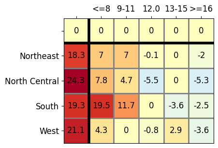

   Terlihat pada gambar di atas bagian _row medians_ (kolom paling kiri)
   terisi dengan nilai median setiap baris. Bagian cells yang berada di bawah
   dan di sebelah kanan garis hitam tebal adalah nilai data yang sudah 
   dikurangi oleh _row medians_.   

## Sweep 2

Pada tahapan ini dilakukan perhitungan median sepanjang baris untuk semua kolom
termasuk kolom _row medians_. Di tahap ini kita telah menemukan _common effect_
yang kita letakkan di bagian pojok kanan atas saat di plot 
(di dalam perhitungan program dan ilustrasi di bawah ini terletak di pojok
kanan bawah). Berikut ilustrasi untuk perhitungan di Sweep 2

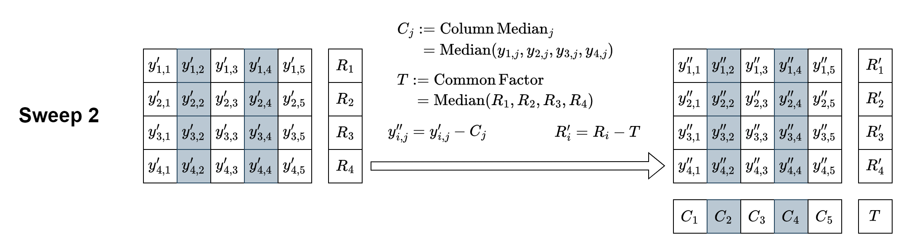

8. Ambil data Sweep 2 dari `infant_median_polish` dan lakukan plotting
   data tersebut dengan mengetikkan kode Python berikut 

   ```py
   fig, ax = plt.subplots(figsize=(4, 4))
   eda_mdpl.plot_polish(infant_median_polish[2], region_label, father_edu_label, 
                         ax, sweep_flag=2)
   plt.show(fig)
   ```

   Nilai argument yang dipasang untuk fungsi `.plot_polish()` masih sama
   seperti langkah sebelumnya, hanya saja kita naikan nilai indeks
   menjadi `2`.

   Jika langkah-langkah di atas dijalankan dengan benar, maka akan didapatkan
   hasil berikut

   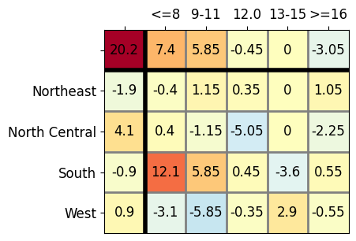

   Dilihat dari hasil di atas makan baris paling atas yang menyatakan
   _column medians_ sudah terisi dengan median untuk setiap baris.
   Dan juga isi cells di bawah dan di sebelah kanan garis hitam tebal
   sudah dikurangi dengan nilai _column medians_ ini. Terlihat kita juga 
   mendapatkan _common effects_ di indeks `[0, 0]`. Nilai ini akan 
   terus diupdate selama proses _sweeping_.

## Sweep 3
Tahap ini mirip dengan Sweep 1, namun ada sedikit tahap tambahan
yaitu dilakukan update juga untuk _row medians_ yang sebelumnya telah dihitung
dan diupdate di Sweep 2. Pertama kita hitung _row medians_ untuk semua baris
termasuk baris _column medians_ (kita sebut $R_i$ dan $R_C$, lihat
ilustrasi di bawah). Nilai _row medians_ ini kita gunakan untuk 
mengurangi nilai cells untuk seluruh cells di sebelah kanan garis hitam tebal
(termasuk _column medians_). Lalu setelah dikurangi dengan _row medians_ 
$R_i$ dan $R_C$, kita update _row medians_ yang didapatkan dari Sweep 2
($R_i'$ dan $T$) dengan $R_i$ dan $R_C$. Secara lebih jelas ditunjukkan pada
ilustrasi di bawah ini

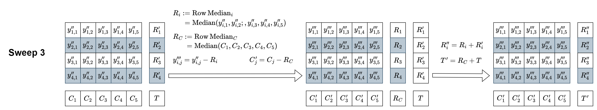

9. Sama seperti langkah sebelumnya, kita panggil hasil perhitungan Sweep 3
   dari variabel `infant_median_polish` dan lakukan plot dengan kode Python
   sebagai berikut

   ```py
   fig, ax = plt.subplots(figsize=(4, 4))
   eda_mdpl.plot_polish(infant_median_polish[3], region_label, father_edu_label, 
                        ax, sweep_flag=3)
   plt.show(fig)
   ```

   Jika langkah di atas dijalankan dengan benar, maka akan diperoleh gambar
   sebagai berikut

   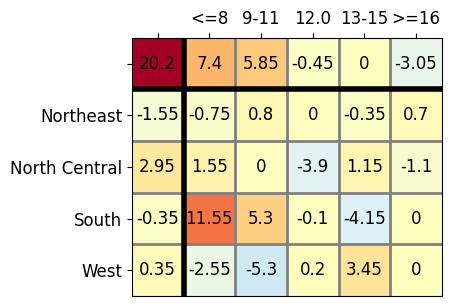

   Ingat dari gambar di atas semua cells mengalami perubahan. Cells di sebelah
   kanan garis hitam tebal mengalami perubahan karena dikurangi oleh 
   _row medians_-nya. Sedangkan _common effect_ dan _row medians_ juga ikut
   berubah dikarenakan adanya proses update (ditambahkan) dengan nilai
   _common effect_ dan _row medians_ dari hasil Sweep 2.

   Terlihat setelah Sweep 3, pola di cells di bawah dan di sebelah kanan 
   garis hitam tebal (kita sebuh _residual cells_) sudah tidak mengalami perubahan
   yang signifikan (pola warna tetap sama) dari Sweep 2.

## Sweep 4
Tahap ini sama seperti Sweep 3 namun arah pengambilan nilai median mengikut
arah seperti Sweep 2. Pertama kita hitung median untuk semua kolom. Kita
namakan _column medians_ ini $C_j$. Lalu kita
kurangkan median ini terhadap _residual cells_ dan _row medians_. Kemudian
kita update nilai _column medians_ dari Sweep 3 ($C_j'$) dengan _column medians_ 
$C_j$ dan juga _common effect_ dari Sweep 3 yaitu $T'$  dengan $C_R$. Ilustrasi
perhitungan tersebut diberikan pada gambar di bawah ini

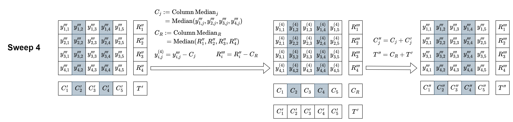

10. Ambil nilai Sweep 4 dari variabel `infant_median_polish` dan lakukan
    plot untuk nilai Sweep 4 tersebut menggunakan kode Python di bawah ini
    ```py
    fig, ax = plt.subplots(figsize=(4, 4))
    eda_mdpl.plot_polish(infant_median_polish[4], region_label, father_edu_label, 
                         ax, sweep_flag=4)
    plt.show(fig)
    ```

    Jika langkah di atas dijalankan dengan benar, maka akan didapatkan gambar
    seperti berikut

    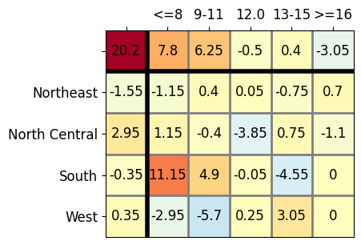

    Jika kita bandingkan gambar _heatmap_ di atas dengan _heatmap_ dari Sweep 3 
    tidak terlalu nampak perbedaan pola warna yang signifikan.

## Iterate (Sweep 3 and 4)
Sebenarnya kita bisa melakukan terus-menerus proses Sweep 3 dan Sweep 4 berurutan
untuk mennghasilkan _additive model_ yang cukup "smooth". Namun di atas Sweep 4
umumnya pola besar kecil (yang diwakili oleh warna) dari _residual cells_ sudahlah
tidak berubah secara signifikan.

Berikut adalah 4 _sweeps_ terakhir (Sweep 3, 4, 5, dan 6)

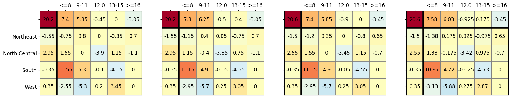


## Interpretion the result of median polish

Berikut adalah perbanding dari hasil Sweep 5 median polish dan representasi 
_additive model_ (dinamakan $\textrm{surf}_{ij}$)

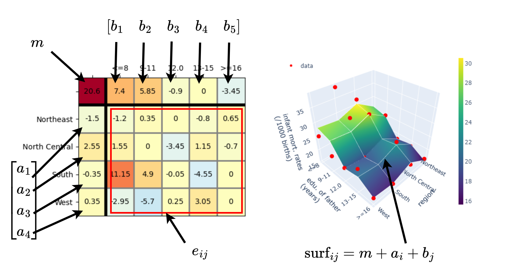

Beberapa hal yang bisa kita ambil kesimpulannya
- Karena median polish menggunakan _additive model_, kita dapat memperoleh 
  kembali data awal, dengan cara menambahkan komponen _residual cells_, 
  _row effect_, _column effect_ dan _common effect_. Lihat persamaan 
  sebelumnya di bagian awal tutorial ini

- Nilai _row medians_ tertinggi adalah $7.4$, menyatakan _infant_ yang dilahirkan
  dari ayah yang berpendidikan kurang dari atau sama dengan 8 tahun,
  memiliki tingkat 7.4 kematian per seribu _infant_ lebih tinggi dari nilai _common value_.
  Nilai absolute-nya adalah 7.4 + 20.6 = 28 kematian per seribu bayi

- _Infant_ dengan ayah yang telah menyelesaikan pendidikan lebih dari
  atau sama dengan 16 tahun, memiliki tingkat kematian lebih kecil dari
  _common value_.

- _Common value_ ini menyatakan nilai tengah-tengah yang mewakili keseluruhan
  data. Bisa dikatakan untuk data yang diberikan, tingkat kematian _infant_
  adalah 20.6 kematian per seribu kelahiran untuk semua jenis kombinasi
  lama studi ayah _infant_ tersebut dan lokasi _infant_ tersebut.

- Dibanding dengan lama studi ayah dari _infant_, lokasi _infant_
  tidak terlalu dominan dan hanya berkisar di antara $-0.35$ hingga $2.55$.
  Dibanding lama studi ayah berkisar $-0.9$ hingga $7.4$.

- Ada sedikit nilai yang amat tinggi di data residual yaitu pada
  baris `South` dan kolom `<=8`. Kajian lebih lanjut dengan melihat faktor-faktor
  lain yang mempengaruhi nilai ini perlu ditelusuri. Misal mungkin ada faktor cuaca
  atau suhu udara, atau tingkat pengangguran.

## Tugas (Exercise 04)
> Laporan harus ditulis dan dikumpulkan dalam bentuk berkas _markdown_ 
> (berekstensi `.md`). Apabila laporan memuat lebih dari satu beras, misal
> memuat gambar `.png` atau `.jpg`, maka berkas disatukan menjadi berkas 
> `.zip`. **PASTIKAN** berkas `.md` sudah dilakukan _preview_, sehingga kod
> `markdown` bisa di-_preview_ dengan benar di VSCode. Format penamaan file: 
> `NIM_NAMA.md` atau `NIM_NAMA.zip`  (boleh nama lengkap atau nama panggilan).
>
> **Contoh format laporan atau jawaban (`NIM_NAMA.md`)**
> Nama: [NAMA LENGKAP]
> NIM: [NIM]
> 1. (Jawaban nomor 1)
> 2. (Jawaban nomor 2)

1. [30 poin]
   Apakah mungkin untuk melakukan _median polish_
   dengan data _multivariate_ lebih dari 3 variables? Jelaskan alasan
   kalian. Sertakan contoh dan/atau gambar/ilustrasi jika memungkinkan.

2. [70 poin] 
   Lakukan proses _median polish_ hingga _Sweep 11_ menggunakan 
   module `eda/medianpolish.py` untuk data berikut yang diambil dari
   [(Berkson, 1958) - Smoking and Lung Cancer: Some Observations on Two Recent Reports. Table 34](https://www.jstor.org/stable/pdf/2282563.pdf)

   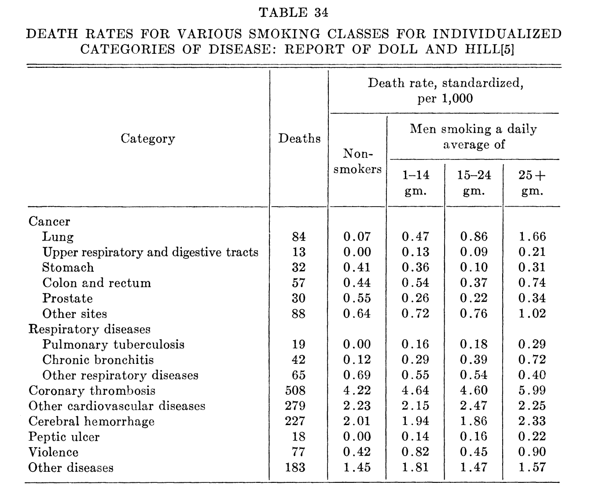

   Petunjuk: Untuk kolom "Deaths" tidak perlu diikutsertakan.


