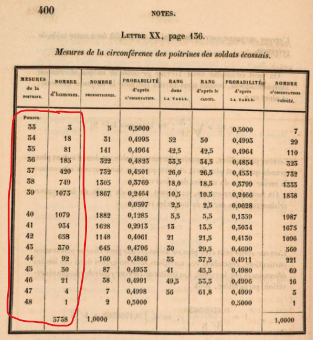
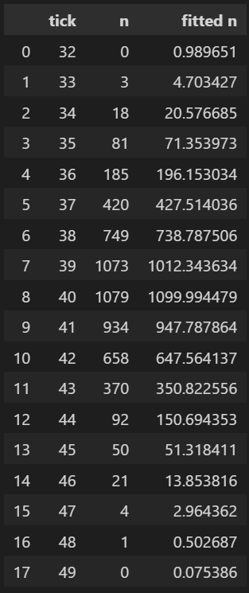
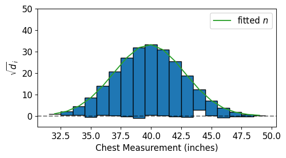
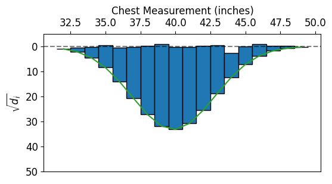
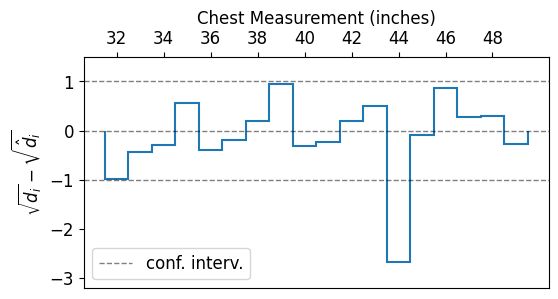

# Modul praktikum - Minggu 07 - Rootogram 

Dosen pengampu: **Henokh Lugo Hariyanto**; **Diana Nurlaily**   
Asisten mata kuliah: **Ukthi Nurul Isnaniah (16211028)**

**Tujuan**:
- Mampu memahami alasan dibalik penggunaan rootogram
- Mampu melakukan visualisasi menggunakan teknik visualisasi rootogram  

> Tips belajar bahasa pemrograman adalah mengetik ulang perintah yang kita
> temukan di buku ataupun di internet, lalu kita ubah-ubah untuk menguji 
> pemahaman kita sudah tepat atau belum. Faktor bermain-main dan eskplorasi
> sangat diperlukan untuk memahami setiap perintah bahasa pemrograman yang
> kita pelajari. Setiap potongan kode di bawah dapat dijalankan secara lokal
> menggunakan VSCode dan Jupyter Notebook, atau menggunakan Google Colab.

Pada pertemuan ini, kita akan membahas mengenai rootogram. Rootogram ini
merupakan salah satu teknik yang digunakan dalam _exploratory data analysis_.
Sebagian besar tutorial di bawah ini diambil dari [(Velleman and Hoaglin, 1981) Chapter 9](https://ecommons.cornell.edu/bitstreams/e5688170-b7d4-4e35-9ba0-ee51b3bed1b4/download)

Alasan adanya rootogram masih sama seperti alasan adanya _resistant line_
saat kita membutuhkan suatu estimasi _trend line_ yang mampu memberikan
estimasi yang _robust_ sekalipun terdapat _outliers_.

Rootogram disini berfungsi agar hasil histogram yang kita dapatkan
tidak terpengaruh oleh fluktuasi yang besar yang sering terjadi pada
frekuensi data yang besar.

Pada penjelasan berikutnya akan diberikan bukti pentingnya rootogram dan
bagaimana melakukan teknik visualisasi dengan rootogram.

## Rootogram

Rootogram merupakan gabungan dua pecahan kata yang dianmbil dari "square ROOT"
 dan "histOGRAM".
Penggambaran histogram secara langsung tidak mampu memberikan visualisasi
yang _robust_ terhadap adanya _outliers_, untuk itu perlu dilakukan transformasi
terhadap besaran frekuensi dengan cara menghitung nilai akarnya daripada
kita hanya melakukan plot histogram dengan nilai frekuensinya.

Untk menggambar rootogram sangatlah sederhana, kita cukup perlu
mengambil akar kuadrat dari frekuensi di plot histogram yang telah kita buat

Disini kita tidak akan membuat dari awal bagaimana melakukan plotting
rootogram dengan residual menggunakan matplotlib. Dalam tutorial ini kita akan
menggunakan module `eda/rootogram.py` yang sudah memiliki beberapa fungsi
untuk menentukan akar kuadrat dari frekuensi di histogram dan fungsi untuk
melakukan plotting rootogram

Data yang digunakan disini adalah data dari [(Quételet, 1846) - Lettres à S. A. R. le duc régnant de Saxe-Cobourg et Gotha, sur la théorie des probabilités - appliquée aux sciences morales et politiques. Page 400](https://babel.hathitrust.org/cgi/pt?id=mdp.39015022383700) merupakan data ukuran lebar dada (dalam satuan inci (1 inci = 2.54 cm)) dari anggota militer di Skotlandia
pada tahun 1846. Menariknya data ukuran lebar dada ini mengikuti distribusi normal.



1. Buat berkas _jupyter notebook_ baru dan _load_ module numpy, pandas, 
   matplotlib, dan `rootogram.py` ke dalam notebook tersebut menggunakan perintah berikut
   ```py
   import numpy as np
   import matplotlib.pyplot as plt
   import pandas as pd
   import eda.rootogram as eda_root
   ```

   [Petunjuk] untuk bisa melakukan _load_ module `rootogram.py`, perlu 
   di-_copy_ folder `eda` yang berada dalam GitHub.

2. Tambahkan beberapa perintah berikut untuk melakukan _automatic loading_
   jika dalam tutorial terdapat perubahan kode di dalam `rootogram.py `
   dan juga tambahan kode untuk melakukan _setting_ gambar yang dihasilkan
   oleh matplotlib
   ```py
   %load_ext autoreload
   %autoreload 2 
   ```

   ```p
   plt.rcParams.update(plt.rcParamsDefault)
   plt.rcParams.update({
     'font.size': 12,
     'grid.alpha': 0.3})
   ```

3. Bacalah data `chest-measurement.csv` menggunakan pandas mengunakan perintah
   berikut
   ```py
   df_chest = pd.read_csv("../datasets/chest-measurement.csv")
   ```

4. Lakukan perhitungan estimasi frekuensi data berdasarkan model
   distribusi normal, kita sebut nilai ini `fitted n` (fitted count). 
   Langkah ini dapat dilakukan dengan cara memanggil 
   fungsi `eda_root.get_fitted_count()`. Jalankan kode Python berikut untuk
   mendapatkan nilai `fitted n`.
   ```py
   df_drr = eda_root.get_fitted_count(
     df_chest["Chest (in.)"].to_numpy(), df_chest["Count"].to_numpy())
   df_drr[["tick", "n", "fitted n"]]
   ```

   Jia langkah di atas dijalankan dengan benar maka akan didapatkan hasil
   sebagai berikub

   

5. Langkah berikutnya kita ingin melakukan plotting rootogram. Disini kita   
   tidak perlu lagi membuat dari awal. Kita cukup menggunakan `eda/rootogram.py`
   Jalankan program berikut untuk melakukan plotting rootogram dari tiga
   kolom dataframe `df_drr` yang sudah kita hitung di langkah sebelumnya
   ```py
   fig, ax = plt.subplots(figsize=(6, 3))
   eda_root.plot_rootogram(df_drr["tick"].to_numpy(), df_drr["n"].to_numpy(),
                           df_drr["fitted n"].to_numpy(), ax, 
                           xlabel="Chest Measurement (inches)",
                           ylabel=r"$\sqrt{d_i}$", ylim=[-5, 50])
   plt.show(fig)
   ```
   
   Penjelasan terkait program di atas adalah untuk baris pertama
   kita membuat variabel untuk objek `Figure` yang disimpan dalam variabel 
   `fig` dan `Axis` yang disimpan dalam variabel `ax`.
   Di dalam module `eda/rootogram.py` ada empat input (arguments) ya
   harus kita masukkan yaitu
   1. `tick` yang diisi dengan array dari kolom `tick` dari `df_drr`.
      Data ini merupakan posisi rootogram di sumbu-$x$.
   2. `count` yang diisi dengan array dari kolom `n` dari `df_drr`.
      Data ini merupakan banyaknya kemunculan nilai `tick`.
   3. `fitted_count` yang diisi dengan array dari kolom `fitted n` 
      dari `df_drr`. Data ini merupakan estimasi dari model distribusi
      banyaknya kemuculan nilai `tick`.
   4. `ax` diisi oleh object yang diperoleh dari `plt.subplots()`.

   Jika langkah diatas dijalankan dengan benar maka akan didapatkan 
   plot sebagai berikut
   
   

   Terlihat di bawah grafik rootogram tidaklah rata seperti halnya histogram
   namun terdapat kenaikan dan penurunan level bawah dari setiap _bar_
   rootogram

## Suspended Rootogram

Gambar rootogram yang telah kita buat pada langkah sebelumnya memiliki
banyak informasi yang berlebih. Sebagai contoh, tinggi rootogram
tidaklah menjadi informasi yang penting, karena sudah diwakili oleh 
nilai estimasi `fitted_count` dari model distribusi yang kita pilih.
Maka daripada itu, sangat sering plotting rootogram ini dibalik dan 
dinamakan sebagai _suspended rootogram_. 

6. Cara untuk membuat plot _suspended rootogram_ tidaklah terlalu rumit, 
   cukup mengetikkan kode Python berikut
   ```py
   fig, ax = plt.subplots(figsize=(6, 3))
   eda_root.plot_suspended_rootogram(df_drr["tick"].to_numpy(), 
                                     df_drr["n"].to_numpy(), 
                                     df_drr["fitted n"].to_numpy(), ax, 
                                     xlabel="Chest Measurement (inches)", 
                                     ylabel=r"$\sqrt{d_i}$", ylim=[-5, 50])
   plt.show(fig)
   ```
   Argument atau input untuk fungsi `plot_suspended_rootogram` masih sama
   dengan `plot_rootogram`. Namun gambar rootogram yang dihasilkan dibalik.
   Ingat bahwa sumbu-$y$ positif mengarah ke bawah.

   

   Terkadang kita hanya ingin mengetahui seberapa besar nilai residual
   (selisih antara $\sqrt{\textrm{count}}$ dan $\sqrt{\textrm{fitted count}}$)
   yang kita gunakan secara cepat untuk mengetahui seberapa baik model 
   distribusi yang kita pilih dengan data yang kita kumpulkan. Pada
   langkah berikutnya kita hanya melakukan plotting residual ini

7. Jalankan kode Python berikut untuk membuat plot residual 
   yang diambil dari _suspended rootogram_. 
   ```py
   fig, ax = plt.subplots(figsize=(6, 3))
   eda_root.plot_suspended_rootogram_res(
     df_drr["tick"].to_numpy(), df_drr["n"].to_numpy(), 
     df_drr["fitted n"].to_numpy(), ax, 
     xlabel="Chest Measurement (inches)",  
     ylim=[-3.2, 1.5], xticks=df_drr["tick"].to_numpy()[::2])
   plt.show(fig)
   ```
   Jika kita jalankan langkah-langkah di atas dengan benar, maka akan 
   didapatkan plot residual sebagai berikut

   

   Pada plot residual di atas terdapat tambahan dua garis horizontal 
   putus-putus yang menunjukkan _confidence interval_. Penentuan
   garis tersebut didasarkan pada 95% confidence interval (atau eksaknya
   95.45%) yang
   mana angka -1 dan 1 diperoleh dari perhitungan cukup rumit.
   Pada bagian ini kita akan melompati hal tersebut. Bagi yang tertarik
   silahkan dibaca di buku (Velleman and Hoaglin, 1981) Section 9.5.

## Tugas (Exercise 05)
> Laporan harus ditulis dan dikumpulkan dalam bentuk berkas _markdown_ 
> (berekstensi `.md`). Apabila laporan memuat lebih dari satu berkas, misal
> memuat gambar `.png` atau `.jpg`, maka berkas disatukan menjadi berkas 
> `.zip`. **PASTIKAN** berkas `.md` sudah dilakukan _preview_, sehingga kod
> `markdown` bisa di-_preview_ dengan benar di VSCode. Format penamaan file: 
> `NIM_NAMA.md` atau `NIM_NAMA.zip`  (boleh nama lengkap atau nama panggilan).
>
> **Contoh format laporan atau jawaban (`NIM_NAMA.md`)**
> Nama: [NAMA LENGKAP]
> NIM: [NIM]
> 1. (Jawaban nomor 1)
> 2. (Jawaban nomor 2)

1. [30 poin]
   Apa yang terjadi jika kita menggunakan akar pangkat tiga dibanding
   dengan akar kuadrat dalam transformasi tinggi _bin_?

2. [70 poin] 
   Lakukan visualisasi dengan menggunakan rootogram untuk data banyaknya
   _satellite_ dari kepiting tapal kuda berikut:

   Apa yang dapat kalian ceritakan dari bentuk residual di dalam
   _suspended rootogram_?


