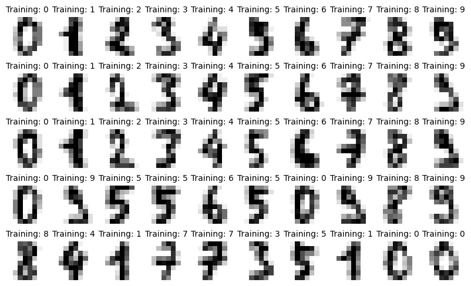
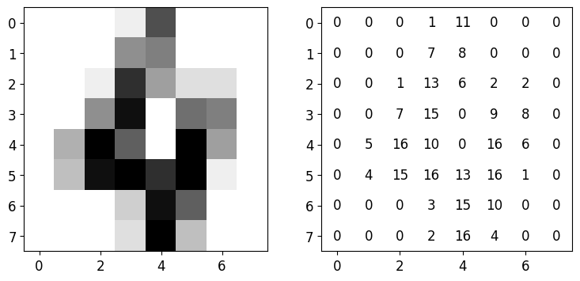
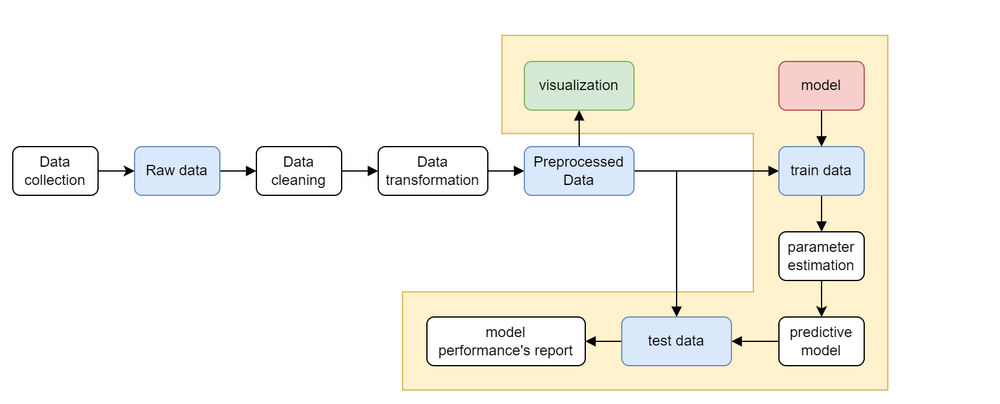
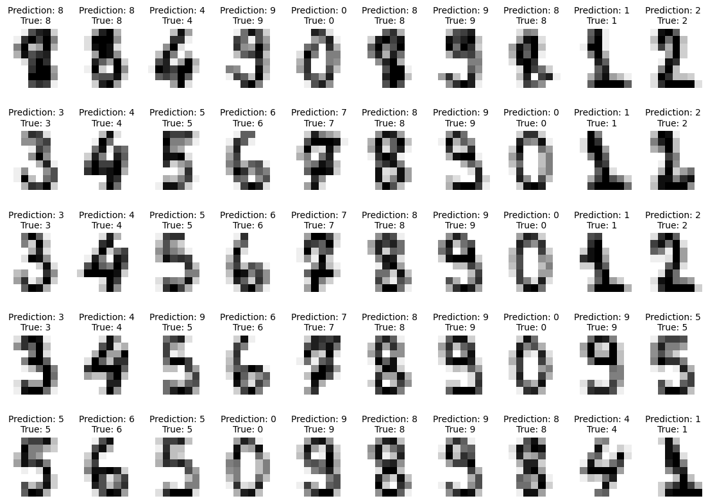

# Modul praktikum - Minggu 09 - Basic Principle of Machine Learning

Dosen pengampu: **Henokh Lugo Hariyanto**; **Diana Nurlaily**   
Asisten mata kuliah: **Ukthi Nurul Isnaniah (16211028)**

**Tujuan**:
- Mampu memahami tahapan-tahapan implementasi machine learning di Python
- Mampu menjalankan ulang dan memahami perintah di Python untuk 
  melakukan klasifikasi digit dari data yang sedikit `scikit-learn` 

> Tips belajar bahasa pemrograman adalah mengetik ulang perintah yang kita
> temukan di buku ataupun di internet, lalu kita ubah-ubah untuk menguji 
> pemahaman kita sudah tepat atau belum. Faktor bermain-main dan eskplorasi
> sangat diperlukan untuk memahami setiap perintah bahasa pemrograman yang
> kita pelajari. Setiap potongan kode di bawah dapat dijalankan secara lokal
> menggunakan VSCode dan Jupyter Notebook, atau menggunakan Google Colab.


Di dalam pertemuan ini kita akan membuat suatu model klasifikasi sebagai contoh 
machine learning yang telah kita pelajar di dalam sesi kelas. Contoh berikut
diambil dari dokumentasi scikit-learn tentang ["Recognizing hand-written digits"](https://scikit-learn.org/stable/auto_examples/classification/plot_digits_classification.html).

## Beberapa istilah di dalam machine learning
Di dalam bagian cukup digunakan sebagai acuan untuk memahami istilah-istilah
yang akan digunakan sepanjang tutorial ini. Beberapa istilah dasar yang perlu 
dipahami adalah.
- _fitur_: merupakan atribut data yang digunakan sebagai faktor yang 
           berpengaruh dalam penentuan nilai yang diprediksi atau
           masalah yang ingin diselesaikan oleh model _machine learning_.
- _label_/_target_: merupakan atribut data yang digunakan sebagai acuan atau
                    nilai yang diprediksi
- _model_: merupakan persamaan matematis yang menggambarkan hubungan antara
           variabel/atribut/fitur dari data yang kita punya.
- _model parameters/weights_: merupakan variabel yang _dipelajari_ oleh model
         sehingga model mampu melakukan prediksi apabila ada data baru
         yang ingin diprediksi labelnya.
- _training_: merupakan proses pencarian parameter terbaik untuk model yang
              diusulkan
- _testing_: merupakan proses uji model terhadap data baru yang belum pernah 
             dilihat

## Masalah klasifikasi: Klasifikas angka dari gambar tulisan tangan
Disini kita akan menyelesaikan masalah klasifikasi gambar tulisan tangan
berbagai angka dari 0 sampai 9 dengan menggunakan teknik klasifikasi. 
Data gambar tulisan tangan diambil dari [https://archive.ics.uci.edu/dataset/80/optical+recognition+of+handwritten+digits](https://archive.ics.uci.edu/dataset/80/optical+recognition+of+handwritten+digits) dan 
sudah terdapat secara otomatis di dalam _library_ `scikit-learn`.

Berikut adalah isi dari data tersebut



Ukuran untuk masing-masing gambar angka tulisan tangan tersebut berukuran
8 x 8 piksel. Berikut adalah salah satu gambar dan isi angka dalam piksel-
piksel



Contoh di atas adalah angka 4 (plot sebelah kiri) dan nilai piksel
dari 0 hingga 16 (plot sebelah kanan). Untuk data ini, setiap piksel
adalah fitur yang akan kita jadikan input untuk model klasifikasi yang akan
kita bangun. Target/label klasifikasi adalah label angka dara gambar angka tulisan tangan tersebut. Sebagai contoh di atas, target/label yang 
menandakan gamabr tersebut adalah angka 4.

Alasan mengapa piksel gambar sangat kecil, karena dataset ini sebenarnya 
adalah penyederhanan data yang lebih besar untuk MNIST digit yang berukuran
28x28 piksel (lihat [(Lecun et al, 2010) - MNIST handwritten digit database](http://yann.lecun.com/exdb/mnist)). Perkembangan terbaru dari 
MNIST ini adalah EMNIST (Extended MNIST) yang memiliki ukuran gambar 
lebih besar yaitu 128x128 piksel. (lihat [(Cohen et al., 2017) - EMNIST: an extension of MNIST to handwritten letters](https://arxiv.org/pdf/1702.05373v2.pdf))

Dengan disederhanakan ukuran gambar yang akan kita klasifikasi, maka kita
tidak terlalu membutuhkan _resource_ komputer yang tinggi atau model yang
rumit.

## Diagram
Berikut adalah diagram secara garis besar proses yang dilakukan dalam
mengolah data dan menggunakan model _mahcine learning_. Diagram berikut dapat
digunakan secara umum untuk melakukan penentuan model terbaik dari model-model
yang diusulkan oleh pengguna



Pada tutorial ini kita tidak lagi melakukan tahap _data collection_, 
_data cleaning_, dan _data transformation_. Hal ini dikarenakan _library_
`scikit-learn` yang kita gunakan sudah memiliki dataset digits yang sudah
dibersihkan dan siap untuk digunakan dalam masalah klasifikasi pelabelan
angka dari gambar tersebut. Kita hanya fokus pada bagian yang diberi warna
area kuning.

Di bagian berikutnya kita akan melakukan pemisahan data (_data splitting_)
antara _train data_ dan _test data_. Alasan diperlukan pemisahan data ini
karena kita menginginkan model yang kita buat dapat melakukan generalisasi.
Maksud dari generalisasi disini adalah model mampu memprediksi label data
dari data yang belum pernah dia "lihat" atau tidak masuk dalam proses
_training_.

Akhir dari tutorial ini kita akan mampu melakukan prediksi untuk _test data_
dan juga melakukan evaluasi seberapa baik model klasifikasi yang telah kita
buat.
 
## Implementasi kode
Pertama kita membuat _jupyter notebook_ untuk pembangunan

1. Buat _notebook_ dengan nama `recoginizing-hand-written-digits.ipynb`.
   dan letakkan dalam direktor `week-09`. Lalu lakukan instalasi _library_
   `scikit-learn` dengan mennjalankan perintah berikut di Anaconda Prompt
   (miniconda) atau PowerShell
   ```bash
   pip install -U scikit-learn
   ```

2. Lakukan _load_ tiga _module_ yang telah sering kita gunakan dalam tutorial
   di minggu-minggu sebelumnya yaitu `numpy`, `matplotlib` dan `pandas`. Kita
   juga perlu melakukan _load_ beberapa _module_ untuk melengkapi proses
   klasifikasi
   ```py
   import numpy as np
   import matplotlib.pyploy as plt
   import pandas as pd

   from sklearn import datasets, metrics, svm
   from sklearn.model_selection import train_test_split
   ```

### Data loading and splitting

3. Kita dapat memanggil data digits dan membaginya 50% ukuran data untuk
   _train data_ dan 50% untuk _test data_.
   ```py
   digits = datasets.load_digits()
   X_train, X_test, y_train, y_test = train_test_split(
      data, digits.target, test_size=0.5, shuffle=False)
   ```
   Baris pertama memanggil dataset digits (gambar angka tulisan tangan).
   Yang berjumlah 1,797 gambar yang masing-masing berukuran 8x8 piksel.
   Hal ini dapat dilihat dengan menjalankan perintah 
   ```py
   print(digits.DESCR)
   ```
   Perintah di atas akan mencetak secara lengkap deskripsi data gambar
   angkah oleh tulisan tangan.

4. Untuk bisa melihat _train data_ dan _test data_, kita bisa melakukan 
   plot sebagai berikut
   ```py
   fig, axes = plt.subplots(nrows=5, ncols=10, figsize=(10, 6))
   for ax, X, label in zip(axes.flatten(), X_train, y_train):
      ax.set_axis_off()
      ax.imshow(X.reshape([8, 8]), cmap=plt.cm.gray_r, interpolation="nearest")
      ax.set_title(f"Training: {label}", fontsize="small")

   plt.show(fig)
   ```
   Melalui perintah di atas akan dicetak 50 gambar yang terdiri dari 10
   gambar angka di tiap barisnya. Kita juga menampilkan label di setiap gambar
   tersebut

   Lalu untuk _test data_, kita melakukan hal yang sama namun menggunakan
   `X_test` dan `y_test`
   ```py
   fig, axes = plt.subplots(nrows=5, ncols=10, figsize=(10, 6))
   for ax, X, label in zip(axes.flatten(), X_test, y_test):
      ax.set_axis_off()
      ax.imshow(X.reshape([8, 8]), cmap=plt.cm.gray_r, interpolation="nearest")
      ax.set_title(f"Test: {label}", fontsize="small")

   plt.show(fig)
   ```

   Lihat dua link berikut, untuk melihat hasil plot di atas
   1. [The first 50 _training images_](../img-resources/ml-digits-train.png)
   2. [The first 50 _test images_](../img-resources/ml-digits-test.png)

   Pada langkah selanjutnya, setelah model klasifikasi yang telah kita bangun
   ditentukan parameter model tersebut, kita akan menguji model tersebut
   ke _test data_. Karena _test data_ memiliki label yang benar (label yang 
   benar ini biasa disebut _ground truth_), maka kita dapat mengevaluasi 
   seberapa baik model klasifikasi yang kita bangun

### Building the model

Model yang dibangun adalah model yang dinamakan SVM (_Support Vector Machine_).
Ide besar model ini adalah mencari suatu garis pemisah antar tiap kelompok-kelompok 
gambar digit. Karena kita tahu setiap gambar digits memiliki 8x8 piksel, jumlah
keseluruhan piksel ada sebanyakm 8 x 8 = 64 piksel. Jumlah 65 piksel adalah 
input data untuk model SVM, sehingga setiap fitur dari input data 
adalah setiap piksel. Karena jumlah fitur yang digunakan cukup tinggi 
maka diperlukan.

5. Disini kita tidak akan menurunkan secara lengkap tata cara atau asal muasal
   persamaan yang mengatur SVM. Untuk menggunakan SVM kita cukup menuliskan perintah
   berikut
   ```py
   clf = svm.SVC(gamma=0.001)
   clf.fit(X_train, y_train)
   ```
   Pada kode di baris pertama kita memanggil fungsi SVC (Support Vector Classification)
   dengan `gamma=0.001`. Argument `gamma` disini mengatur seberapa besar pengaruh
   titik-titik _train data_ ke  garis pemisah antara label.
   Lihat penjelasan di dalam dokumentasi `scikit-learn`[berikut](https://scikit-learn.org/stable/auto_examples/svm/plot_svm_kernels.html#rbf-kernel) untuk lebih jelas

   Lalu di baris kedua kita melakukan proses _training_. Dalam hal ini diwakili
   dengan perintah `.fit()` di dalam `scikit-learn`. Di akhir tahap ini kita 
   akan mendapatkan model klasifikasi yang sudah di-_train_ dengan _train data_ 
   (`X_train` dan `y_train`).


### Predict the _test data_.
Di tahap ini kita akan mencoba melakukan klasifikasi data baru (_test data_)
dan mencoba mengukur seberapa baik model klasifikasi yang kita buat

6. Untuk melakukan prediksi kita hanya cukup menjalankan perintah berikut
   ```py
   predicted = clf.predict(X_test)
   ```

   Variabel `predicted` ini akan kita bandingkan dengan _ground truth_ `y_test`. 

7. Untuk menguji seberapa baik model yang dibuat terutama untuk _binary classifier_,
   biasanya digunakan _confusion matrix_ karena mampu menangkap
   hasil-hasil yang terlalu baik untuk label-label tertentu 
   namun detail dari model yang mempengaruhi alasan hasil evaluasi
   model _binary classifier_ sangat baik.

   Jalankan kode Python berikut untuk menghitung _confusion matrix_.
   ```py
   disp = metrics.ConfusionMatrixDisplay.from_predictions(y_test, predicted)
   print(f"Confusion matrix:\n{disp.confusion_matrix}")
   ```

   Jika langkah-langkah di atas dijalankan dengan benar maka akan didapatkan
   _confusion matrix_ sebagai berikut
   
   ```
   Confusion matrix:
   [[87  0  0  0  1  0  0  0  0  0]
    [ 0 88  1  0  0  0  0  0  1  1]
    [ 0  0 85  1  0  0  0  0  0  0]
    [ 0  0  0 79  0  3  0  4  5  0]
    [ 0  0  0  0 88  0  0  0  0  4]
    [ 0  0  0  0  0 88  1  0  0  2]
    [ 0  1  0  0  0  0 90  0  0  0]
    [ 0  0  0  0  0  1  0 88  0  0]
    [ 0  0  0  0  0  0  0  0 88  0]
    [ 0  0  0  1  0  1  0  0  0 90]]
   ```
   Maksud dari _confusion matrix_ di atas sebagai berikut:
   - bagian baris menunjukkan _true label_, atau label sebenarnya dari 
     _test data_. Dengan label 0 (angka 0) berada pada baris di indeks ke-0
     hingga label 0 (angka 9) ke bawah.
   - bagian kolom menunjukkan _predicted label_, atau label yang diprediksi
     dengan model SVC. Dengan label 0 (angka 0).
   - angka di dalam setiap elemen menunjukkan jumlah gambar yang mampu diprediksi
     oleh model SVC. Sebagai contoh element 85 di baris indeks-2 dan kolom 
     indeks-2. Angka 85 ini menunjukkan ada 85 gambar yang berhasil benar
     diprediksi sebagai angka 2. Jika kita melihat di baris indeks-0 dan 
     kolom indeks 2, elemen bernilai 1, menunjukan ada satu gambar diprediksi 
     sebagai angka 2 namun label yang sebenarnya adalah angka 0.

   Dari hasil _confusion matrix_ di atas terlihat bahwa model klasifikasi SVC
   cukup baik untuk melakukan setiap predikis di setiap kelas. Hal ini terlihat
   dari jumlah prediksi benar berada dalam element diagonal dari _confusion
   matrix_

   Di minggu berikutnya kita akan belajar beberapa metrik (alat ukur) 
   yang lebih baik yang dapat dihitung dari _confusion matrix_ yaitu
   _precision_, _recall_, dan F1-score.

### Plot uji coba prediksi model ke _test data_
8. Kita akan melakukan prediksi untuk beberapa gambar dari _test data_
   dengan kode berikut
   ```py
   fig, axes = plt.subplots(nrows=5, ncols=10, figsize=(14, 10))
   for ax, image, prediction, label in zip(axes.flatten(), X_test, predicted, y_test):
      ax.set_axis_off()
      image = image.reshape(8, 8)
      ax.imshow(image, cmap=plt.cm.gray_r, interpolation="nearest")
      ax.set_title(f"Prediction: {prediction}\nTrue: {label}", fontsize="small")

   plt.show(fig)
   ```

   Jika langkah di jalankan dengan benar maka akan didapatkan gambar sebagai
   berikut

   


## Tugas (Exercise 06)
> Laporan harus ditulis dan dikumpulkan dalam bentuk berkas _markdown_ 
> (berekstensi `.md`). Apabila laporan memuat lebih dari satu berkas, misal
> memuat gambar `.png` atau `.jpg`, maka berkas disatukan menjadi berkas 
> `.zip`. **PASTIKAN** berkas `.md` sudah dilakukan _preview_, sehingga kod
> `markdown` bisa di-_preview_ dengan benar di VSCode. Format penamaan file: 
> `NIM_NAMA.md` atau `NIM_NAMA.zip`  (boleh nama lengkap atau nama panggilan).
>
> **Contoh format laporan atau jawaban (`NIM_NAMA.md`)**
> Nama: [NAMA LENGKAP]
> NIM: [NIM]
> 1. (Jawaban nomor 1)
> 2. (Jawaban nomor 2)

1. [30 poin] Lakukan eksplorasi data yang lain yang tersedia di dalam 
   _library_ `scikit-learn`. Data yang kita gunakan dalam tutorial ini
   disebut _toy datasets_. Silahkan ditelusuri _toy datasets_ apa saja yang
   tersedia di dalam _library_ `scikit-learn`.

2. [70 poin] Lakukan hal yang sama untuk _toy dataset_ 
   [the breast cancer wisconsin dataset](https://scikit-learn.org/stable/modules/generated/sklearn.datasets.load_breast_cancer.html#sklearn.datasets.load_breast_cancer)
