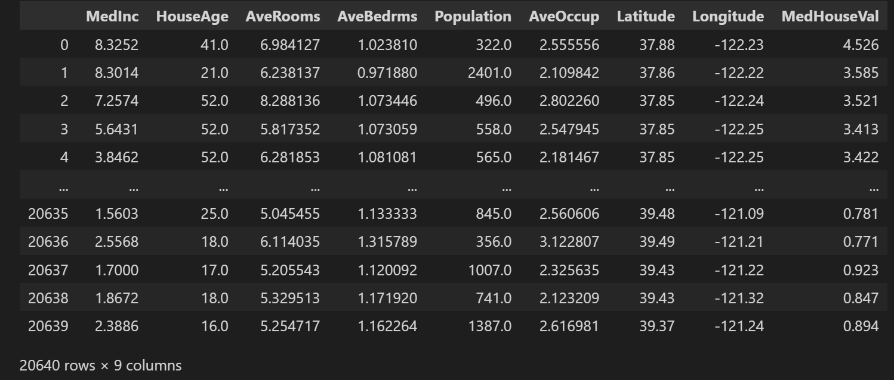
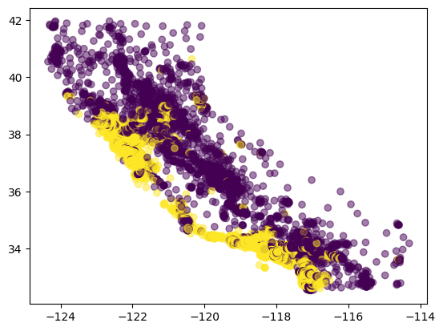
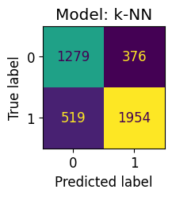
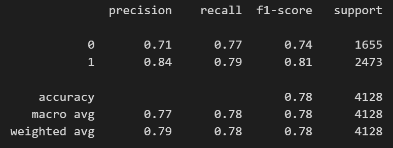
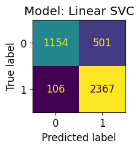
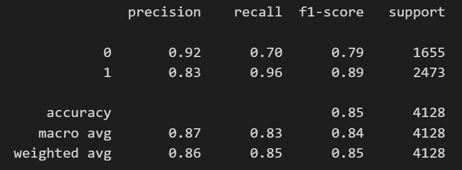

# Modul praktikum - Minggu 10 - Classification model

Dosen pengampu: **Henokh Lugo Hariyanto**; **Diana Nurlaily**   
Asisten mata kuliah: **Ukthi Nurul Isnaniah (16211028)**

**Tujuan**:
- Mampu memahami tahapan-tahapan penggunaan model klasifikasi yang 
  disedikan oleh _library_ `scikit-learn`. 
- Mampu menjelaskan perbedaan (kelebihan dan kekurangan) untuk tiga model
  klasifikasi yaitu k-NN, SVM, dan Decisition Tree. 

> Tips belajar bahasa pemrograman adalah mengetik ulang perintah yang kita
> temukan di buku ataupun di internet, lalu kita ubah-ubah untuk menguji 
> pemahaman kita sudah tepat atau belum. Faktor bermain-main dan eskplorasi
> sangat diperlukan untuk memahami setiap perintah bahasa pemrograman yang
> kita pelajari. Setiap potongan kode di bawah dapat dijalankan secara lokal
> menggunakan VSCode dan Jupyter Notebook, atau menggunakan Google Colab.

Dalam pertemuan ini kita akan mempelajari tiga model dasar yang digunakan untuk   
melakukan klasifikasi. Sebagai pembanding, kita akan menggunakan dataset yang   
sama untuk ketiga model yang akan kita buat. Di akhir tutorial ini diharapkan  
dapat mengerti perbedaan ketiga model tersebut melalui hasil yang diberikan.

## Masalah klasifikasi
Masalah yang kita ambil dalam tutorial ini adalah masalah klasifikasi, yaitu   
diberikan pasangan input/feature dan output/label data, kita mencari model   
yang mampu menghubungkan dua pasangan data tersebut. Agar kita dapat memahami  
penggunaan model klasifikasi ke data yang dikumpulkan dari pengukuran langsung   
di lapangan, kita akan menggunakan contoh dataset yang terkenal yaitu 
[California housing dataset](https://www.dcc.fc.up.pt/~ltorgo/Regression/cal_housing.html)

Dataset ini terdiri dari 20,640 samples dengan dimensi input/feature sebanyak 
8, dan output/label berupa bilangan riil antara 0.15 sampai 5 (dengan 
satuan $100,000). Karena problem yang akan diselesaikan adalah masalah klasifikasi
dan output/label bernilai kontinyu, maka kita perlu membagi nilai label ini
ke dalam dua kategori yaitu _high value_ dan _low value_ yang diwakili oleh
angka 1 dan 0 berturut-turut.

1. Buatlah direktori `week-10` dan buat juga di dalam direktori tersebut     
   _notebook_ dengan nama `california-housing.ipynb`. Selanjutnya ketikan    
   perintah berikut untuk memuat tiga _library_: `numpy`, `pandas`, `matplotlib`   
   ```py
   import numpy as np
   import pandas as pd
   import matplotlib.pyplot as plt
   ```

   Perlu diingat untuk memiliki _base kernel_ dan versi Python adalah 
   3.11.

2. Kita juga perlu menambahkan beberapa fungsi di `scikit-learn` sebagai berikut
   pada _cell_ di bawah _import_ `numpy`, `pandas`, dan `matplotlib`
   ```py
   from sklearn import datasets, svm, metrics
   from sklearn.preprocessing import StandardScaler
   from sklearn.pipeline import make_pipeline
   from sklearn.neighbors import KNeighborsClassifier
   from sklearn.model_selection import train_test_split 
   ```

   Perlu diingat apabila _library_ `sklearn` belum diinstall, maka perlu 
   dilakukan instalasi terlebih dahulu (lihat tutorial week-09)
   Baris pertama merupakan _module_ yang berisi pemanggilan berbagai 
   macam dataset, salah satunya dataset yang akan kita gunakan yaitu
   California housing dataset. Lalu `svm` digunakan untuk
   melakukan klasifikasi berdasarkan Support Vector Machine, dan `metrics`  
   digunakan untuk mengevaluasi seberapa baik model klasifikasi melalui 
   perhitungan _precision_ dan _recall (serta F1-score) dari hasil klasifikasi
   untuk _test data_.
   Baris kedua merupakan merupakan suatu prosedur untuk mengubah input data $x$
   ke dalam bentuk normal $x'$ atau bisa dituliskan $x = (x - \mu)/\sigma$
   dengan $\mu$ dan $\sigma$ adalah rata-rata dan standard deviasi dari 
   input data $x$.   
   Baris ketiga digunakan untuk melakukan penyambungan transformasi
   `StandardScaler` dan model klasifikasi yang kita pilih ke dalam satu
   kerangka besar atau disebut _pipeline_.   
   Baris keempat digunakan untuk melakukan klasifikas berdasarkan model
   $k$-Nearest Neighbors.   
   Dan baris terakhir digunakan untuk memisahkan input dan output data
   menjadi dua kelompok _train data_ dan _test data_.

   Tambahkan juga perintah berikut, agar hasil plot saat menggunakan
   `matplotlib` cukup _compact_
   ```py
   plt.rcParams.update(plt.rcParamsDefault)
   plt.rcParams.update({
      'font.size': 12,
      'grid.alpha': 0.3})
   ```
   
3. Kemudian kita akan memanggil dataset California housing dengan perintah 
   berikut dan mengubahnya ke dalam tipe data DataFrame.
   ```py
   housing = datasets.fetch_california_housing(as_frame=True)
   df_housing = housing.frame
   df_housing
   ``` 
   
   Jika perintah diatas dijalankan dengan benar maka akan dihasilkan
   tampilan tabel untuk dataset California housing sebagai berikut
   
   


4. Untuk mendapatkan penjelasan masing-masing kolom gambar di atas, kita dapat
   menjalankan perintah berikut untuk melihat deskripsi atau informasi terkait
   datastet California housing ini
   ```py
   print(housing.DESCR)
   ```


   Delapan kolom pertama adalah data input/feature dan kolom terakhir
   `MedHouseVal` adalah output/label. Karena nilai-nilai pada kolom `MedHouseVal`
   berupa numerik, yang seharusnya digunakan untuk regresi seperti yang telah 
   dijelaskan pada paragraf sebelumnya, kita akan mengubaha `MedHouseVal` ini 
   ke dalam data kategori dengan memilah untuk harga rumah lebih besar atau
   sama dengan $180,000, akan kita beri label 1 (_high value_) dan kurang
   dari $180,000 sebagai label 0.

5. Jalankan perintah berikut untuk membuat array baru bernilai 0 dan 1
   sesuai kategori harga rumah dan menambahkannya ke 
   ```py
   arr_medhouseval = df_housing["MedHouseVal"].values
   arr_medhouselabel = np.zeros(len(arr_medhouseval), dtype=int)
   arr_medhouselabel[arr_medhouseval >= 1.8] = 1
   df_housing["MedHouseLabel"] = arr_medhouselabel
   ```

   Pada baris pertama kita membuat variabel `arr_medhouseval` untuk 
   menyimpan nilai dari kolom `MedHouseVal` dari DataFrame `df_housing`.
   Lalu kita membuat variabel baru `arr_medhouselabel` dengan menginisialisasi
   array tersebut dengan nilai 0 dan tipe data integer. 
   Menggunakan _boolean indexing_ (`arr_medhouseval >= 1.8`), kita dapat
   menyeleksi indeks (nomor baris) dari array `arr_medhouseval` yang bernilai
   lebih besar atau sama dengan 1.8.
   Terakhir, kita tambahkan array label ini ke kolom terakhir DataFrame
   `df_housing`.

6. Klasifikasi yang akan kita lakukan _hanya_ menggunakan dua input kolom
   yaitu `Longitude` dan `Latitude`. Untuk itu kita lakukan plot untuk
   melihat apakah dapat dibedakan dua area berdasarkan harga rumah. 
   Untuk itu jalankan kode Python berikut
   ```py
   fig, ax = plt.subplots()

   ax.scatter(df_housing["Longitude"].values, df_housing["Latitude"].values,
               c=df_housing["MedHouseLabel"].values, alpha=0.5, cmap="viridis")

   plt.show(fig)
   ```

   Baris pertama menunjukkan inisialisasi objek Figure dan Axis. Axis berada
   di dalam Figure, dan objek Axis memuat semua plot yang akan kita tambahkan.

   Lalu kita tambahkan _scatterplot_ dengan koordinat sumbu-x adalah 
   `df_housing["Longitude"].values` dan koordinate sumbu-y adalah 
   `df_housing["Latitude"].values`. Warna untuk membedakan dua kategori
   _high values_ dari harga rumah menggunakan argument `c=df_housing["MedHouseLabel"].values`. Kita tambahkan argument `alpha=0.5` untuk 
   membuat titik-titik _scatterplot_ transparent, dan jenis pewarnaannya
   (warna yang digunakan) adalah  `cmap="viridis"`.

   Baris terakhir adalah untuk menampilkan hasil plot. Jika langkah diatas
   dijalankan dengan benar maka akan didapatkan gambar sebagai berikut
   
   

7. Sebelum kita melakukan proses klasifikasi, terlebih dahulu kita pisahkan
   dataset yang kita miliki ke dalam bagian _train data_ dan _test data_.
   Jalankan perintah berikut untuk memisahkan antara input/feature dan 
   output/label ke dalam bagian _train data_ dan _test data_.   
   [Perlu hati-hati dalam mengetikkan input/feature yaitu menggunakan huruf
    kapital `X` dan untuk output/label menggunakan huruf kecil `y`]
   ```py
   data = df_housing[["Longitude", "Latitude"]].values

   X_train, X_test, y_train, y_test = train_test_split(
     data, df_housing["MedHouseLabel"].values, test_size=0.2, shuffle=False)
   ```

   Di baris pertama, kita mengumpulkan input data ke dalam suatu array
   berukuran $(N \times 2)$ dengan $N$ adalah jumlah data yaitu 20,640 baris.

   Berikutnya menggunakan `train_test_split`, kita pisahkan features dan labels
   dengan ukuran _train data_ adalah 80% dari jumlah data, dan kita tidak
   acak urutan data.

   Di bagian selanjutnya kita akan menggunakan variabel 
   `X_train`, `X_test`, `y_train`, dan `y_test` di dalam ketiga model 
   klasifikasi yang akan kita buat.

## $k$-Nearest Neighbors
Seperti yang telah di bahas pada pertemuan kuliah, model $k$-NN ini
melakukan prediksi label dengan cara mendata semua label terdekat dengan
titik data yang akan diprediksi. Kemudian dilakukan _majority vote_, label
mana yang paling sering muncul. Label yang paling sering muncul ini akan
menjadi label prediksi untuk data yang kita ingin prediksi labelnya.

8. Jalankan perintah berikut untuk melakukan proses training dengan 
   model $k$-NN.
   ```py
   knn_model = make_pipeline(
      StandardScaler(),
      KNeighborsClassifier(5))

   knn_model.fit(X_train, y_train)    # training process
   ```
   Di baris pertama kita memanggil prosedur `make_papeline` untuk 
   menggabungkan dua prosedur yaitu `StandardScaler()` dan 
   `KNeighborsclassifier()`. Prosedur pertama `StandardScaler()` mewakili
   normalisasi input data $x$ menuju normalisasi data $x'$, yang diberikan
   oleh persamaan $x' = (x - \mu)/\sigma$ dengan $\mu$ dan $\sigma$ adalah
   rata-rata dan standard deviasi dari input data $x$. Prosedur kedua
   adalah proses klasifikasi menggunakan $k$-NN dengan jumlah tetangga
   sebanyak $k = 5$ tetangga terdekat.

   Lalu baris terakhir adalah menerapkan model yang sudah kita buat ke dalam
   _train data_ (`X_train` dan `y_train`).

9. Selanjutnya kita lakukan predjksi model terhadap `test data` yang sudah 
   kita pisahkan dari keseluruhan data pada langkah sebelumnya. Satu baris
   berikut cukup untuk menjalankan proses prediksi
   ```py
   y_pred_knn = knn_model.predict(X_test)
   ```

10. Supaya hasil prediksi dapat kita evaluasi, untuk itu kita menggunakan 
    _Confusion matrix_ untuk melihat seberapa banyak titik di _test data_
    yang benar diprediksi dan yang kurang tepat diprediksi. 
    ```py
    fig, ax = plt.subplots(figsize=(4, 4))

    metrics.ConfusionMatrixDisplay.from_predictions(y_test, y_pred_knn, ax=ax,
                                                    colorbar=False)
    ax.set_title(f"Model: k-NN")

    plt.show(fig) 
    ```

    Jika langkah di atas dijalankan dengan benar akan didapatkan hasil berikut

    

    Jumlah data yang berhasil diprediksi benar ada pada diagonal 
    dari pojok kiri atas (1,279) hingga pojok kanan bawah (1,954).

11. Di dalam klasifikasi, pelaporan seberapa baik model klasifikasi yang 
    digunakan dapat dinyatakan dengan _precision_ and _recall_. 
    Kedua ukuran ini dapat digabungkan menjadi suatu ukuran yang dinamakan
    F1-score. Dengan menggunakan perintah berikut, kita dapat menghitung
    F1-score
    ```py
    print(metrics.classification_report(y_test, y_pred_knn))
    ```

    Yang memberikan hasil sebagai berikut

    

    Semakin dekat nilai F1-score ke angka 1, semakin baik model klasifikasi
    yang dipilih. Dari hasil diatas didapatkan F1-score untuk 
    model $k$-NN dengan label 0 dan 1 adalah 0.74 dan 0.81 berturut-turut.

## Support Vector Machine
Untuk model kedua yaitu SVM, kita akan menggunakan _module_ `svm.LinearSVC`.
SVC merupakan singkatan dari Support Vector Classifier. 
Alur training, testing, dan evaluasi model masih sama seperti model 
$k$-NN sebelumnya.

11. Jalankan program berikut untuk melakukan training menggunakan model
    linear SVM.  
    ```py
    svm_model = make_pipeline(
      StandardScaler(),
      svm.LinearSVC(dual="auto"))

    svm_model.fit(X_train, y_train)
    ```

12. Lakukan prediksi terhadap _train data_ dengan model `svm_model`
    dengan kode Python  berikut
    ```py
    y_pred_svm = svm_model.predict(X_test)
    ```

13. Tahap berikutnya adalah plot _confusion matrix_ dengan perintah berikut
    ```py
    fig, ax = plt.subplots(figsize=(2, 2))

    metrics.ConfusionMatrixDisplay.from_predictions(y_test, y_pred_svm, ax=ax,
                                                    colorbar=False)
    ax.set_title(f"Model: Linear SVC")

    plt.show(fig)
    ```

    Jika langkah-langkah di atas dijalankan dengan benar akan didapatkan hasil 
    berikut

    

14. Terakhir adalah menghitung F1-score untuk model Linear SVM
    ```py
    print(metrics.classification_report(y_test, y_pred_svm))
    ```

    Didapatkan hasil sebagai berikut

    

## Decision Tree
Di bagian ini akan diselesaikan di bagian _Exercise 07_


## Tugas (Exercise 07)
> Laporan harus ditulis dan dikumpulkan dalam bentuk berkas _markdown_ 
> (berekstensi `.md`). Apabila laporan memuat lebih dari satu berkas, misal
> memuat gambar `.png` atau `.jpg`, maka berkas disatukan menjadi berkas 
> `.zip`. **PASTIKAN** berkas `.md` sudah dilakukan _preview_, sehingga kod
> `markdown` bisa di-_preview_ dengan benar di VSCode. Format penamaan file: 
> `NIM_NAMA.md` atau `NIM_NAMA.zip`  (boleh nama lengkap atau nama panggilan).
>
> **Contoh format laporan atau jawaban (`NIM_NAMA.md`)**
> Nama: [NAMA LENGKAP]
> NIM: [NIM]
> 1. (Jawaban nomor 1)
> 2. (Jawaban nomor 2)

1. [70 poin] Menggunakan [`DecisionTreeClassifier()`](https://scikit-learn.org/stable/modules/generated/sklearn.tree.DecisionTreeClassifier.html#), 
   lakukan klasifikasi California Dataset dengan input/features 
   `Longitude`, `Latitude` dan output/label `MedHouseLabel` seperti yang
   telah dilakukan dengan model $k$-NN dan linear SVM.

2. [30 poin] Apa yang terjadi jika saat pembagian data
   menggunakan setting-an `shuffle=True`. Apakah nilai F1-score
   dari ketiga klasifikasi di atas lebih baik atau lebih buruk.
   Jika lebih baik atau lebih buruk jelaskan alasannya.